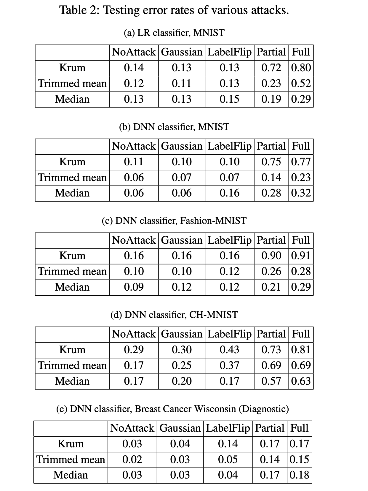
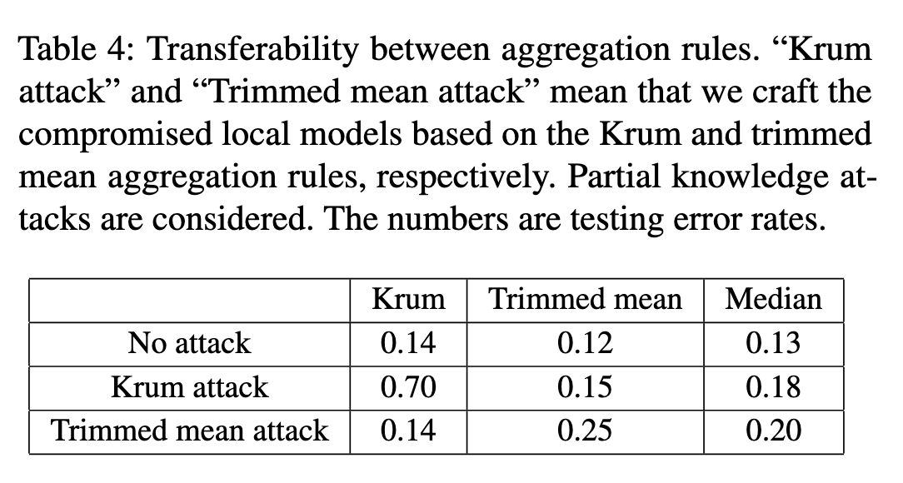

# 局部模型投毒攻击联邦学习《Local Model Poisoning Attacks to Byzantine-Robust Federated Learning》

## 初识

对联邦学习的攻击主要可以分为两种，第一种是对训练数据进行投毒。第二种是对局部模型进行扰动，使用局部模型提供的梯度对Server以及其他client进行攻击。 本篇工作系统地研究了局部模型投毒对 `Byzantine-Robust` 联邦学习的影响(攻击力)。 文章的工作也表明了，目前对于修改局部模型参数的方法，并没有很有效的防御方法。

:::tip

核心内容为提出了 `local model poisoning attack` 这种方法，并通过梯度下降的方式去更新模型参数。

:::

## 相知

### 联邦学习一般步骤

联邦学习一般可以分为三步：

1、主设备 `master` 将当前全局模型参数发送给所有工作设备

2、工作设备 `client ` 使用当前全局模型参数和它们的本地训练数据集并行更新它们的本地模型参数。 更新完本地参数后再将参数发送回 `master` 设备

3、`master` 收到了 `clients` 的参数后将所有的参数做一个 `aggregates` 作为全局模型的参数

这里的第二步和第三步就是联邦学习可以使用 `local model poisoning` 去攻击的关键。 将本地参数发送回 `master`, 也就是说攻击者可以通过操控 `client` 的参数来影响 `master` 的模型参数信息。 

### Aggregation Rules

最简单的 `aggregation` 方法就是将所有 `client` 的参数做一个平均。 这种方法是 `non-adversarial` 的，因为恶意客户端可以很容易的操控 `master` 的参数。 目前也有提出一些 `adversarial` 的 `aggregation relus`, 例如 Krum [1] 和 Bulyan [2]。 Krum 的做法是从 m 个模型中选出来一个和其他模型都很相似的作为全局模型。这样做的依据也非常的好理解，即使我选出来的这个模型是来着与被攻击的客户端的，但是这个模型和其他正常客户端传回的模型都很相似，这样就可以尽可能少的降低其有害的影响。 算是 Bulyan 是 Krum 的改进版，这里不做详细介绍了。

还有一个 `aggregation` 的方法叫做 `Trimmed mean`[3] 它是通过去除一定数量的最大值和最小值，然后将剩余的数据点加起来并除以剩余数据点的数量来计算得出的。这个数量通常是根据数据集的大小和分布情况来确定的。使用 `trimmed mean` 可以减少极端值对平均值的影响。 还有一种方法叫做 `Median`[3], Median 是一种用于检测和过滤掉恶意节点所提供的错误数据的统计量。通过计算每个节点提供的数据值的中位数，排除掉那些明显偏离数据集分布的数据点，从而提高分布式学习的鲁棒性和准确性。

### 攻击方法

本篇的核心就是它的攻击方法，上面我们已经简单介绍了几种不同的 `aggregation relus`，在攻击的时候，如果聚合方式已知就用已知的聚合方式去进行攻击，如果未知就假定一种聚合方式进行攻击。实验表明，局部模型投毒的攻击效果可以在不同聚合方式之间传播，比如说攻击者不知道实际对方使用的聚合方式，在攻击的时候假定对方使用 Krum 算法进行攻击，即使对方使用的不是 Krum，攻击者的攻击还是会有一定的效果。

#### 优化目标

攻击者的目标是将一个全局模型参数朝着没有攻击时的相反方向最大程度地偏离。作者通过解决一个优化问题，制作恶意的本地模型，使得攻击后的全局模型参数偏离目标方向。 优化目标公式如下：

$$
\begin{gathered}
\max _{\mathbf{w}_1^{\prime}, \cdots, \mathbf{w}_c^{\prime}} \mathbf{s}^T\left(\mathbf{w}-\mathbf{w}^{\prime}\right) \\
\text { subject to } \mathbf{w}=\mathcal{A}\left(\mathbf{w}_1, \cdots, \mathbf{w}_c, \mathbf{w}_{c+1}, \cdots, \mathbf{w}_m\right) \\
\mathbf{w}^{\prime}=\mathcal{A}\left(\mathbf{w}_1^{\prime}, \cdots, \mathbf{w}_c^{\prime}, \mathbf{w}_{c+1}, \cdots, \mathbf{w}_m\right)
\end{gathered}
$$

- $\mathbf{w}_i$ 是第 $i$ 个 `client` 设备，发送给主设备的本地模型。
- $\mathbf{w}_1^{\prime}, \mathbf{w}_2^{\prime}, \cdots, \mathbf{w}_c^{\prime}$ 是攻击者制作的恶意的本地模型，其目的是将全局模型参数朝着没有攻击时的相反方向最大程度地偏离。
- $\mathbf{s}^T\left(\mathbf{w}-\mathbf{w}^{\prime}\right)$ 是攻击的目标函数，其中 $\mathbf{s}$ 是全局模型参数变化的方向，$\mathbf{w}$ 是没有攻击时的全局模型，$\mathbf{w}^{\prime}$ 是攻击后的全局模型。攻击者的目标是最大化这个目标函数，使得攻击后的全局模型参数偏离目标方向。
- $\mathcal{A}$ 是聚合规则，即将所有本地模型合并成一个全局模型的规则。

提出的优化目标需要针对不同的 `aggregation rule` （Krum、Trimmed Mean 和 Median）分别进行修改。这里不再详细说明。

### 实验结果

  

实验结果表明，作者提出的攻击方法有效，并且比现有攻击方法更优秀。同时，作者也发现，相比于 Krum 聚合规则，修剪平均和中值聚合规则更加鲁棒，因为 `Krum` 只选择一个本地模型作为全局模型，而 `Trimmed Mean` 和 `Median` 规则会聚合多个本地模型更新全局模型。其次，作者也发现，数据的维度会影响错误率，DNN分类器在 CH-MNIST 数据集上的错误率普遍比其他数据集高，在 Breast Cancer Wisconsin (Diagnostic) 数据集上的错误率普遍比其他数据集低。最后，作者得出结论，在用户的训练数据只能存储在他们的边缘/移动设备上且存在攻击的情况下，采用 `Byzantine-robust federated learning` 可能是最好的选择，即使其错误率更高。

  

这篇论文中针对联邦学习中的三种聚合规则进行了攻击实验，表4展示了不同聚合规则之间的攻击传递性。实验结果表明，`Krum` 攻击可以成功地传递到 `trimmed mean` 和median聚合规则上，例如对于 `trimmed mean` 规则，`Krum` 攻击将错误率从 0.12 增加到 0.15（相对增加了25%），对于median规则，将错误率从 0.13 增加到 0.18（相对增加了38%）。但是， `trimmed mean` 攻击无法传递到 `Krum` 聚合规则上，但可以成功地传递到 `median` 聚合规则上，例如对于median规则，`trimmed mean` 攻击将错误率从0.13增加到0.20（相对增加了54%）。

## 相识

本文的主要 idea 是通过梯度下降的方式，去修改本地模型的参数进而去攻击全局的模型。之前的工作都是通过数据投毒的方式去攻击联邦学习。文章的实验结果表明，作者提出的攻击方法对当下的防御算法都能进行有效的攻击。但是对于 `trimmed mean` 和 `median` 攻击效果偏差。 对不同数据集的攻击效果也有比较大的差别，并且需要针对不同的 `aggregation relu` 调整优化目标，不同 `aggregation relu` 之间攻击性传递性较差。

## Reference

[1] Peva Blanchard et al. “Machine learning with adversaries: byzantine tolerant gradient descent” Neural Information Processing Systems(2017): n. pag.

[2] El Mahdi El Mhamdi et al. “The Hidden Vulnerability of Distributed Learning in Byzantium” arXiv: Machine Learning(2018): n. pag.

[3] Dong Yin et al. “Byzantine-Robust Distributed Learning: Towards Optimal Statistical Rates” arXiv: Learning(2018): n. pag.

