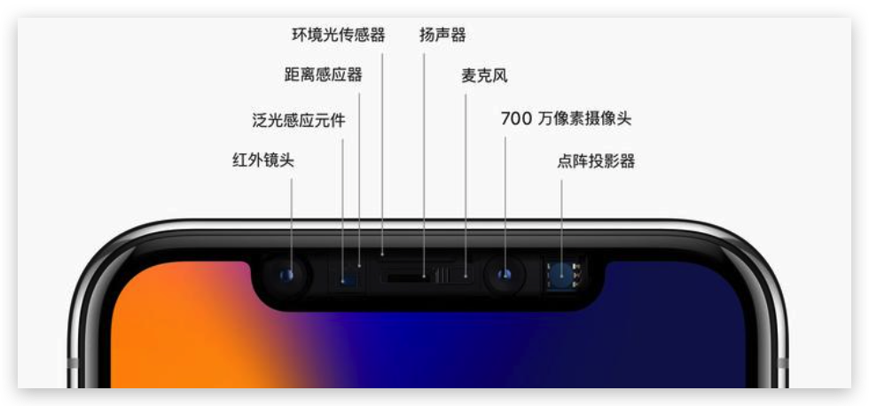
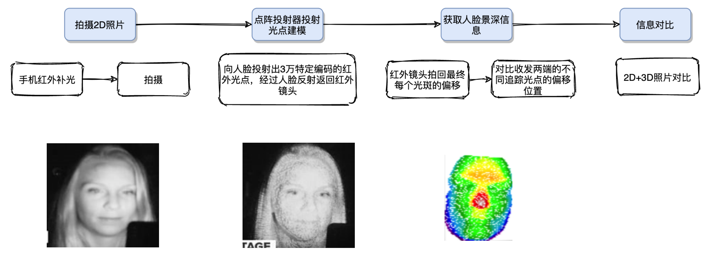
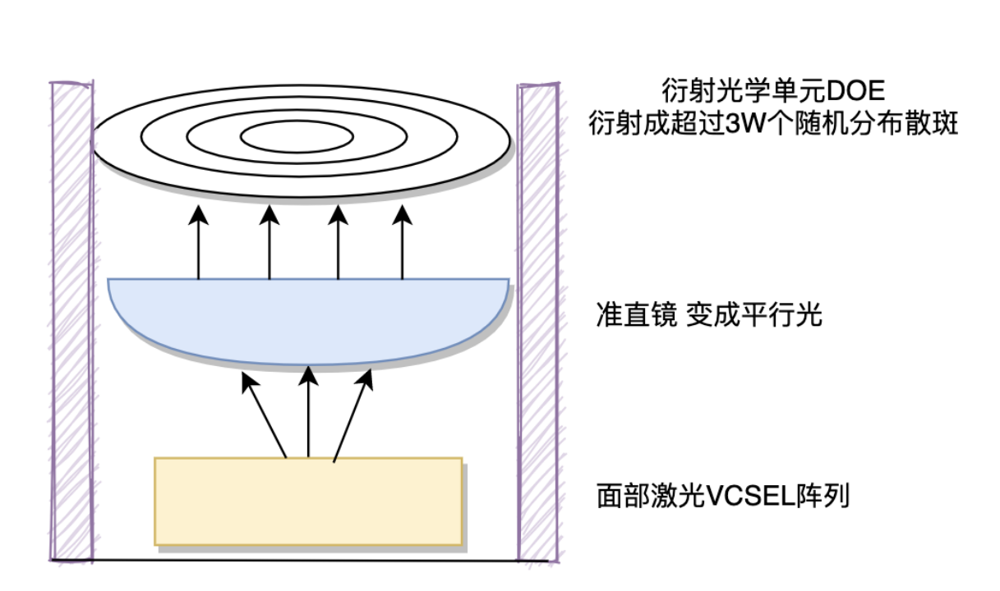
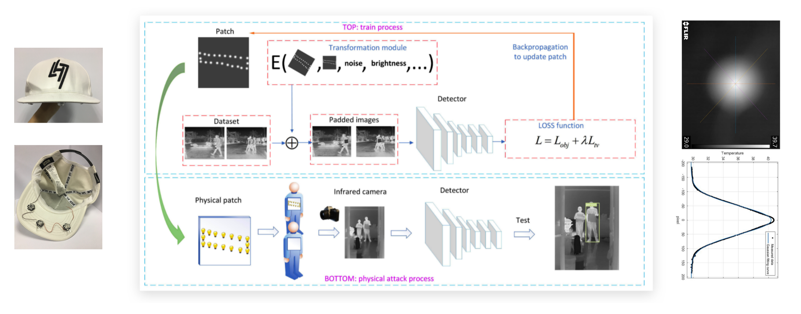

# 多模态对抗攻击「人脸识别」

## 手机厂商人脸识别算法调研

### 苹果 Apple

苹果的FaceID算是所有手机里面最有名的人脸识别算法了，苹果的人脸识别算法是基于3D结构光来做的，每次进行扫脸的时候都会有非常多的红外点映射到你的脸上，下面是苹果官方介绍FaceID的描述:

用于实现面容 ID 的技术是我们迄今为止开发出的一些最先进的硬件和软件。原深感摄像头会通过投射并分析成千上万个不可见的点来捕获准确的面部数据，进而创建您面部的深度图；另外它还会捕获您面部的红外图像。A11 芯片、A12 仿生芯片、A12X 仿生芯片、A13 仿生芯片、A14 仿生芯片和 A15 仿生芯片的神经网络引擎有一部分安全存放于安全隔区中，它会将深度图和红外图像转换为数学表示形式，然后再将这个表示形式与注册的面部数据进行对比。(好像都直接不用RGB了)

### 华为 Huawei

华为官方描述："3D 人脸识别，采集更多面容信息，识别更安全，更准确。采用 TOF 3D 超感技术，暗光也能识别人脸。"

TOF 3D超感技术就是通过发射近红外光，传感器计算红外光与目标触达返回时间差，从而实现立体视觉

### 算法总结

除了苹果和华为之外，很多厂商都是使用的**3D结构光**以及**TOF**去进行手机的人脸识别。苹果现在还是使用的3D结构光来完成FaceID， 除了手机解锁，3D结构光还被广泛用于刷脸支付、智能安防、空间扫描、机器人交互、商用屏显、体感游戏等领域，具有广阔的市场空间。例如在刷脸支付领域，国内3D传感企业奥比中光自主研发的3D结构光摄像头，为**支付宝**、**中国银联提供模组**支持，通过3D人脸识别，可以实现快速安全便捷支付，目前刷脸支付设备已经成功落地全国。

  

:::tip
所以说当下3D人脸识别以及逐渐普及，并且广泛的应用在了非常广泛的领域里面，如果能够攻击基于3D结构光的人脸识别算法，那么将会对当下的手机市场造成非常大的威胁
:::

## 3D 人脸检测流程

当下的3D人脸识别主要可以分为两类，一类是传统的方法，一类是基于深度学习的方法：

这里还是着重介绍一下基于深度学习的3D人脸识别算法。

几乎所有基于深度学习的方法都使用预先训练好的网络，然后针对转换后的数据对这些网络进行微调 (e.g. 2D images from 3D faces)。
基于深度学习的人脸算法并不需要提取关键点特征，它们可以从数据集中学习到更加具有鲁棒性的人脸特征。下图中展示了3D人脸识别的流程：

在了解基于DCNN的3D人脸识别方法之前，我们先快速的回顾一下2D基于DCNN的人脸识别算法。

### 2D人脸识别

Deepface[2]模型是一个九层的深度神经网络，它是在一个包括4M个人脸图像和超过4k个身份的标记数据集上训练的。
Deepface采用了基于3维模型校准的方法，对LFW数据集的对准度达到了97.35%。
DeepId系列的文章（DeepID[3]，DeepID2[4]，DeepID2+[5]，DeepID3[6]）从多个面部区域提取特征。
后续也有很多研究中对 `损失函数`, `Backbone` 还有网络结构等进行改进。但是所有方法的目的都是想要获取一个更好的人脸和特征向量的Embedding方法。

### 3D人脸识别

:::tip
大多数的3D人脸识别算法分为了两步，一步是根据点云进行人脸重建，第二步是将3D的点云映射成一个2D图或者一个深度图进行后续的人脸识别。
:::

下图[7]中展示了3D人脸识别过程，首先离散点云会被映射成一个深度图，然后深度图被送入到神经网络当中，使用损失函数去引导训练过程。人脸的认证是根据输入向量的余弦距离来计算的。

### 3D人脸检测常用的数据集

3D人脸检测的常用数据集有ND-2006[8]，Bosphours[9]，CASIA[10]还有UMBDB[11]等；

## 3D 结构光

视频资料：[https://www.youtube.com/watch?v=F1eWql_sVHE](https://www.youtube.com/watch?v=F1eWql_sVHE)

文档资料：[https://pure.tue.nl/ws/portalfiles/portal/46965337/777871-1.pdf](https://pure.tue.nl/ws/portalfiles/portal/46965337/777871-1.pdf)

### 主要流程

  

### 两种结构光

结构光主要可以分为点结构光和线结构光，当前手机上使用的主要是点结构光。

- 点结构光：点结构光技术只是对点状光斑进行处理，算法简单，计算复杂度小  ✅

  

-  线结构光：发射线状的光源，根据光线的弯曲去对物体进行重建

  

### 点阵激光原理

点阵激光是人脸重建的核心，它可以为3D重建提供XYZ轴的信息。Z轴也就是人脸的深度信息，红外激光发射器发射出近红外光，经过人手或人脸的反射之后，被红外图像传感器所接收，这个信息用来计算Z轴的信息

  

## 人脸攻击相关工作

### Optical Adversarial Attack

**光学对抗性攻击**是物理对抗性攻击的一个子类。这种攻击**使用低成本的投影仪改变目标物体上的光照**，以逃避正确的分类。与二维或三维打印对象相比，该方法在单次攻击时成本更低，能够实现大规模攻击。这个想法首先由 Nicoles 等人在2018年 [12]提出，但他们的方法需要在每次攻击中迭代捕获和优化。周等人在2018年通过**在帽子下安装了一些红外发光二极管来攻击人脸识别系统**，因为红外光是肉眼看不见的，但是大多数摄像机都能捕捉到 [13]。但是他们的方法需要额外的红外硬件，并且成功率有限。Worzyk等人在2019年对道路上的停车标志进行了研究 [14]。但是他们只在印刷图像上做实验，而不是在真实世界的物体上。 Nguyen等人在2020年也将光学对抗性攻击 [15]应用于2d人脸识别系统。他们**考虑了投影仪的颜色失真，因此每次攻击只需投影一次**。在2021年，Gnanasambandam等人通过考虑光学的空间变化和光谱非线性 [16]，改进了Nguyen的攻击方法，使其更加具有鲁棒性。所有这些光学攻击都针对二维深度学习模型。然而，二维光学攻击不能直接用于三维场景，因为它们的成像原理有很大的不同。

  

### 3D Adversarial Attack

3D对抗性攻击专注于为3D深度学习模型生成对抗性的例子。目前大多数3D攻击算法的目标是点云模型。在2019年，Xiang 等人 [17]首次提出了对点云的对抗性攻击，通过两种不同的方式操作良性数据: 点扰动和点生成。Zheng等[18]通过**基于显著性图删除一些关键点**的方式来欺骗深度学习模型。为了提高攻击的可转移性，Hamdi [19]等人开发了advPC，通过**添加一个编码器重构模块来优化**攻击，提高了对于不同模型的攻击成功率。其他的研究基于对抗性点云的几何特性，着重于提高对抗性攻击的不可感知性 [20,21]。除了点云，Yang等 [22]提出了**基于三维网格的MeshAdv**攻击。然而，这些攻击主要是数字化的，很少有人讨论过它们在现实世界中的应用。在物理实现层面，曹等人在2019年研究了**基于激光雷达传感器的对抗性3D攻击**，该传感器广泛应用于自动驾驶车辆 [23]。他成功地骗过了汽车，并通过延时模块和激光发射器增加了假的前方靠近障碍物。

  

### 3D Attack against FR system

[24] 的工作中提出了一种新颖的、物理上可以实现的对边缘结构光系统的攻击，称为结构光攻击。该攻击利用一台投影机将光学对抗性条纹投射到人脸上，产生具有对抗性的点云。下图是攻击的流程：

  

黑色框图是结构光成像的过程。红色的框图是结构化的攻击过程，主要包括对抗性的点云生成和反函数映射到投影仪输入端的3D对抗性点云。

#### 对基于结构光的人脸识别系统建模

基于结构光的人脸识别系统由两部分组成: **条纹投影成像系统**和**人脸识别算法**。FPP系统首先按顺序投影获取一组相移图像，然后利用相移算法重建三维形状，并将其发送到人脸识别系统。因此，[24] 中将基于结构光的人脸识别系统建模为一个由投影仪、人脸、摄像机、三维重建算法和三维数据分类器组成的串行系统(图3)。

**Projector**：数字投影仪由于硬件缺陷或者考虑到对人眼的拟合，往往会产生非线性的灰度失真。假设$I_i^s$是投影仪输入的第$i$个相移图像。Projector的输出图像 $I_i^s = f(I_i^p)$, $f(\cdot)$ 是投影机的响应函数，可以模拟为一个指数函数：

$$
I_{i}^{s}=f\left(I_{i}^{p}\right) \approx\left(I_{i}^{p}\right)^{\gamma}
$$

其中 $\gamma$ 是投影仪的参数。投影仪的非线性灰度失真会引入重建误差，导致攻击失败。因此，需要对其进行矫正。

**Object**：投影仪的输出将照亮面的表面。假设环境光和表面反射率在图像坐标 $(x,y)$ 是 $a(x,y)$ 和 $r(x,y)$. 然后相机捕捉到的条纹强度可以表示为：

$$
I_{i}^{o}\left(x_{c}, y_{c}\right)=r\left(x_{c}, y_{c}\right), I_{i}^{p}\left(x_{p}, y_{p}\right)+a\left(x_{c}, y\right)
$$

**Camera**：照相机的输出 $I_{i}^{c}=g\left(I_{i}^{o}\right)$, $g(\cdot)$ 是CCD相机的响应函数。假设相机是一个工业数码相机具有良好的线性度。这个假设在大多数商业/结构光系统中都是合理的。此外[24]中认为投影机作为一个逆相机。 如果 $(x_p, y_p)$ 在投影图像投影到三维位置是 $(x_w,y_w,z_w)$ 在相机的输出中被标记为$(x_c,y_c)$。$I_i^c$和$I_i^o$和3维坐标的关系如下：

$$
\begin{aligned}
I_{i}^{c}\left(x_{c}, y_{c}\right) &=\alpha I_{i}^{o}\left(x_{c}, y_{c}\right) \\
z_{c}\left[x_{c} y_{c} 1\right]^{\mathrm{T}} &=M_{c} T_{c}\left[x_{w} y_{w} z_{w} 1\right]^{\mathrm{T}} \\
z_{p}\left[x_{p} y_{p} 1\right]^{\mathrm{T}} &=M_{p} T_{p}\left[\begin{array}{llll}
x_{w} & y_{w} & z_{w} & 1
\end{array}\right]^{\mathrm{T}}
\end{aligned}
$$

其中 $\alpha$ 是一个常数，大约等于1。$M_c$ 和 $T_c$ 分别是相机的内部和外部矩阵。$M_p$ 和 $T_p$ 是投影仪的内部和外部矩阵。$Z_c$ 和 $Z_p$ 是相机和投影仪的缩放因子。

**3D reconstruction algorithm** : 对于三维数据重建块，输入是一组用于相位展开的相位分割图像，输出是点云 $P$。首先计算了缠绕相位 φ$_w$ 和相机相位 φ$_c$的绝对相位。最后，通过求解三维坐标变换来重建人脸的三维坐标。3D重建的过程可以用如下公式表示：

  

**3D data classifier** 

[24] 中建立了三维数据分类器模型 $y=\mathcal{M}(P)$，其中输入为三维点云$P$，输出为人脸识别任务的预测标签 $y$。

#### 生成 3D transform-invariant 的对抗性点

接下来讨论一下如何在人脸点云上生成对抗性扰动。假设对抗性的噪声是在原有点云基础上的额外噪声，让原有点云从 $P$ 变为 $P'$。为了减小三维重建的误差，[24] 中对$z$方向进行了限制。为3D点云添加对抗性扰动可以公式化表示如下：

  

然而，在现实世界中，由于人可能有小的动作和面部表情时，从而导致攻击的效果。为了解决这个问题，[24] 中提出了三维变换不变损失的方法，使得对抗点云在物理攻击中更具鲁棒性。三维变换不变损失包括较小的刚性变换、正态分布噪声和一个重归一化函数。新的损失函数表达式为：

$$
\min _{\Delta} \sum_{i=0}^{k-1} f_{t^{\prime}}\left(\mathcal{M}\left(\mathcal{N}\left(\mathcal{T}_{i} \mathcal{P}+\Delta+\gamma \mathcal{N}_{i}(0,1)\right)\right)\right) \quad \text { s. } t . \quad \mathcal{D}\left(\mathcal{P}, \mathcal{P}^{\prime}\right) \leq \epsilon
$$

$\mathcal{T}_{i}$是3D变换矩阵，包括3D旋转，3D转换。$\mathcal{N}_i$是z轴上的正态分布噪声，用以模拟重构误差。$\gamma$ 是一个比例系数。$\mathcal{N}(\cdot)$ 是重归一化函数。使用PGD和二进制搜索[17]来优化这个损失函数。

  

## 攻击难点

1. 如何干涉3D结构光，或者TOF算法产生的3D模型，并让生成的3D模型具有攻击性？
2. 如何让生成的人脸的特征空间和任意一个人脸接近（破解人脸识别，具有通用的攻击性）
3. 3D人脸的模拟用代码的实现问题

## 参考文献

[1] [3D Face Recognition: A Survey](https://arxiv.org/pdf/2108.11082.pdf)

[2] Y. Taigman, M. Yang, M. Ranzato, and L. Wolf, “Deepface: Closing the gap to human-level performance in face verification,” in Pro- ceedings of the IEEE conference on computer vision and pattern recognition, 2014, pp. 1701–1708.

[3] Y. Sun, Y. Chen, X. Wang, and X. Tang, “Deep learning face representation by joint identification-verification,” in Advances in neural information processing systems, 2014, pp. 1988–1996.

[4] Y. Sun, X. Wang, and X. Tang, “Deep learning face representation from predicting 10,000 classes,” in Proceedings of the IEEE confer- ence on computer vision and pattern recognition, 2014, pp. 1891– 1898.

[5] Sun, Yi, X. Wang, and X. Tang, “Deeply learned face representa- tions are sparse, selective, and robust,” in Proceedings of the IEEE conference on computer vision and pattern recognition, 2015, pp. 2892–2900.

[6] Y.Sun,D.Liang,X.Wang,andX.Tang,“Deepid3:Facerecognition with very deep neural networks,” arXiv preprint arXiv:1502.00873, 2015.

[7] Y.Tan,H.Lin,Z.Xiao,S.Ding,andH.Chao,“Facerecognitionfrom sequential sparse 3d data via deep registration,” in 2019 International Conference on Biometrics (ICB). IEEE, 2019, pp. 1–8.

[8] T. C. Faltemier, K. W. Bowyer, and P. J. Flynn. Using a multi-instance enrollment representation to improve 3d face recognition. In IEEE International Conference on Biomet- rics: Theory, Applications, and Systems, pages 1–6, 2007. 5

[9] A. Savran, B. Sankur, and M. T. Bilge. Comparative evalu- ation of 3d vs. 2d modality for automatic detection of facial action units. Pattern recognition, 45(2):767–782, 2012. 5

[10] C.Xu,T.Tan,S.Li,Y.Wang,andC.Zhong.Learningeffec- tive intrinsic features to boost 3d-based face recognition. In European Conference on Computer Vision, pages 416–427. Springer, 2006. 5, 7

[11] A. Colombo, C. Cusano, and R. Schettini. Umb-db: A database of partially occluded 3d faces. In Computer Vi- sion Workshops (ICCV Workshops), 2011 IEEE Interna- tional Conference on, pages 2113–2119. IEEE, 2011. 5

[12] N. Nichols and R. Jasper, “Projecting trouble: Light based adversarial attacks on deep learning classifiers,” arXiv preprint arXiv:1810.10337, 2018.

[13] Z. Zhou, D. Tang, X. Wang, W. Han, X. Liu, and K. Zhang, “Invisible mask: Practical attacks on face recognition with infrared,” arXiv preprint arXiv:1803.04683, 2018.

[14] N. Worzyk, H. Kahlen, and O. Kramer, “Physical adversarial attacks by projecting perturbations,” in International Conference on Artificial Neural Networks, pp. 649–659, Springer, 2019.

[15] D.-L. Nguyen, S. S. Arora, Y. Wu, and H. Yang, “Adversarial light projection attacks on face recognition systems: A feasibility study,” in Proceedings of the IEEE/CVF Conference on Computer Vision and Pattern Recognition Workshops, pp. 814–815, 2020.

[16] A. Gnanasambandam, A. M. Sherman, and S. H. Chan, “Optical adversarial attack,” in Proceedings of the IEEE/CVF International Conference on Computer Vision, pp. 92–101, 2021.

[17] C. Xiang, C. R. Qi, and B. Li, “Generating 3d adversarial point clouds,” in Proceedings of the IEEE/CVF Conference on Computer Vision and Pattern Recognition, pp. 9136–9144, 2019. 

[18] T. Zheng, C. Chen, J. Yuan, B. Li, and K. Ren, “Pointcloud saliency maps,” in Proceedings of the IEEE/CVF International Conference on Computer Vision, pp. 1598–1606, 2019. 

[19] A. Hamdi, S. Rojas, A. Thabet, and B. Ghanem, “Advpc: Transferable adversarial perturbations on 3d point clouds,” in European Conference on Computer Vision, pp. 241–257, Springer, 2020.

[20] Y. Wen, J. Lin, K. Chen, C. P. Chen, and K. Jia, “Geometry-aware generation of adversarial point clouds,” IEEE Transactions on Pattern Analysis and Machine Intelligence, 2020. 

[21] Q. Huang, X. Dong, D. Chen, H. Zhou, W. Zhang, and N. Yu, “Shape-invariant 3d adversarial point clouds,” arXiv preprint arXiv:2203.04041, 2022. 

[22] D. Yang, C. Xiao, B. Li, J. Deng, and M. Liu, “Realistic adversarial examples in 3d meshes,” arXiv preprint arXiv:1810.05206, vol. 2, 2018. 

[23] Y. Cao, C. Xiao, B. Cyr, Y. Zhou, W. Park, S. Rampazzi, Q. A. Chen, K. Fu, and Z. M. Mao, “Adversarial sensor attack on lidar-based perception in autonomous driving,” in Proceedings of the ACM SIGSAC conference on computer and communications security, pp. 2267–2281, 2019.

[24] Yanjie Li, Yiquan Li, Bin Xiao, “A Physical-World Adversarial Attack Against 3D Face Recognition” arXiv preprint arXiv:2205.13412, 2022. 

