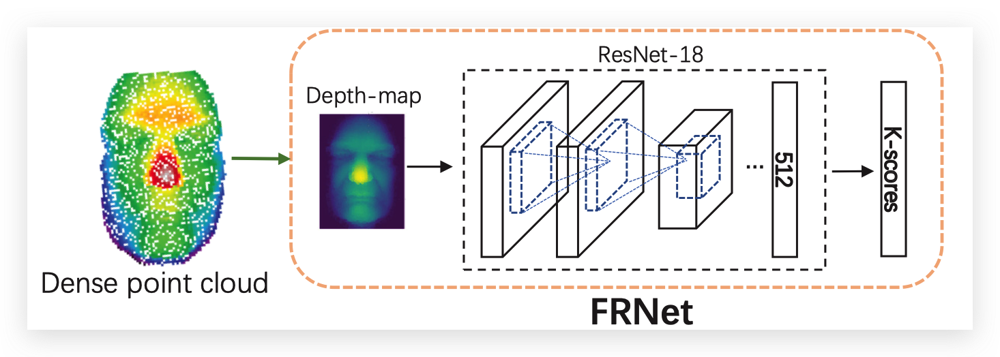

# 多模态对抗攻击「人脸识别」

## 手机厂商人脸识别算法调研

### 苹果 Apple

苹果的FaceID算是所有手机里面最有名的人脸识别算法了，苹果的人脸识别算法是基于3D结构光来做的，每次进行扫脸的时候都会有非常多的红外点映射到你的脸上，下面是苹果官方介绍FaceID的描述:

用于实现面容 ID 的技术是我们迄今为止开发出的一些最先进的硬件和软件。原深感摄像头会通过投射并分析成千上万个不可见的点来捕获准确的面部数据，进而创建您面部的深度图；另外它还会捕获您面部的红外图像。A11 芯片、A12 仿生芯片、A12X 仿生芯片、A13 仿生芯片、A14 仿生芯片和 A15 仿生芯片的神经网络引擎有一部分安全存放于安全隔区中，它会将深度图和红外图像转换为数学表示形式，然后再将这个表示形式与注册的面部数据进行对比。(好像都直接不用RGB了)

  

### 华为 Huawei

华为官方描述："3D 人脸识别，采集更多面容信息，识别更安全，更准确。采用 TOF 3D 超感技术，暗光也能识别人脸。"

TOF 3D超感技术就是通过发射近红外光，传感器计算红外光与目标触达返回时间差，从而实现立体视觉

### 算法总结

除了苹果和华为之外，很多厂商都是使用的**3D结构光**以及**TOF**去进行手机的人脸识别。苹果现在还是使用的3D结构光来完成FaceID， 除了手机解锁，3D结构光还被广泛用于刷脸支付、智能安防、空间扫描、机器人交互、商用屏显、体感游戏等领域，具有广阔的市场空间。例如在刷脸支付领域，国内3D传感企业奥比中光自主研发的3D结构光摄像头，为**支付宝**、**中国银联提供模组**支持，通过3D人脸识别，可以实现快速安全便捷支付，目前刷脸支付设备已经成功落地全国。

  

:::tip
所以说当下3D人脸识别以及逐渐普及，并且广泛的应用在了非常广泛的领域里面，如果能够攻击基于3D结构光的人脸识别算法，那么将会对当下的手机市场造成非常大的威胁
:::

## 3D 人脸检测流程

当下的3D人脸识别主要可以分为两类，一类是传统的方法，一类是基于深度学习的方法：

  

这里还是着重介绍一下基于深度学习的3D人脸识别算法。

几乎所有基于深度学习的方法都使用预先训练好的网络，然后针对转换后的数据对这些网络进行微调 (e.g. 2D images from 3D faces)。
基于深度学习的人脸算法并不需要提取关键点特征，它们可以从数据集中学习到更加具有鲁棒性的人脸特征。下图中展示了3D人脸识别的流程：

  

在了解基于DCNN的3D人脸识别方法之前，我们先快速的回顾一下2D基于DCNN的人脸识别算法。

### 2D人脸识别

Deepface[2]模型是一个九层的深度神经网络，它是在一个包括4M个人脸图像和超过4k个身份的标记数据集上训练的。
Deepface采用了基于3维模型校准的方法，对LFW数据集的对准度达到了97.35%。
DeepId系列的文章（DeepID[3]，DeepID2[4]，DeepID2+[5]，DeepID3[6]）从多个面部区域提取特征。
后续也有很多研究中对 `损失函数`, `Backbone` 还有网络结构等进行改进。但是所有方法的目的都是想要获取一个更好的人脸和特征向量的Embedding方法。

  

### 3D人脸识别

:::tip
大多数的3D人脸识别算法分为了两步，一步是根据点云进行人脸重建，第二部是将3D的点云映射成一个2D图或者一个深度图进行后续的人脸识别。
:::

下图[7]中展示了3D人脸识别过程，首先离散点云会被映射成一个深度图，然后深度图被送入到神经网络当中，使用损失函数去引导训练过程。人脸的认证是根据输入向量的余弦距离来计算的。

  

### 3D人脸检测常用的数据集

3D人脸检测的常用数据集有ND-2006[8]，Bosphours[9]，CASIA[10]还有UMBDB[11]等；

## 3D 结构光人脸识别

视频资料：[https://www.youtube.com/watch?v=F1eWql_sVHE](https://www.youtube.com/watch?v=F1eWql_sVHE)

文档资料：[https://pure.tue.nl/ws/portalfiles/portal/46965337/777871-1.pdf](https://pure.tue.nl/ws/portalfiles/portal/46965337/777871-1.pdf)

## 去攻击难点

1. 如何干涉3D结构光，或者TOF算法产生的3D模型，并让生成的3D模型具有攻击性？
2. 如何让生成的人脸的特征空间和任意一个人脸接近（破解人脸识别，具有通用的攻击性）
3. 3D人脸的模拟用代码的实现问题

## 参考文献

[1] [3D Face Recognition: A Survey](https://arxiv.org/pdf/2108.11082.pdf)

[2] Y. Taigman, M. Yang, M. Ranzato, and L. Wolf, “Deepface: Closing the gap to human-level performance in face verification,” in Pro- ceedings of the IEEE conference on computer vision and pattern recognition, 2014, pp. 1701–1708.

[3] Y. Sun, Y. Chen, X. Wang, and X. Tang, “Deep learning face representation by joint identification-verification,” in Advances in neural information processing systems, 2014, pp. 1988–1996.

[4] Y. Sun, X. Wang, and X. Tang, “Deep learning face representation from predicting 10,000 classes,” in Proceedings of the IEEE confer- ence on computer vision and pattern recognition, 2014, pp. 1891– 1898.

[5] Sun, Yi, X. Wang, and X. Tang, “Deeply learned face representa- tions are sparse, selective, and robust,” in Proceedings of the IEEE conference on computer vision and pattern recognition, 2015, pp. 2892–2900. 

[6] Y.Sun,D.Liang,X.Wang,andX.Tang,“Deepid3:Facerecognition with very deep neural networks,” arXiv preprint arXiv:1502.00873, 2015.

[7] Y.Tan,H.Lin,Z.Xiao,S.Ding,andH.Chao,“Facerecognitionfrom sequential sparse 3d data via deep registration,” in 2019 International Conference on Biometrics (ICB). IEEE, 2019, pp. 1–8.

[8] T. C. Faltemier, K. W. Bowyer, and P. J. Flynn. Using a multi-instance enrollment representation to improve 3d face recognition. In IEEE International Conference on Biomet- rics: Theory, Applications, and Systems, pages 1–6, 2007. 5

[9] A. Savran, B. Sankur, and M. T. Bilge. Comparative evalu- ation of 3d vs. 2d modality for automatic detection of facial action units. Pattern recognition, 45(2):767–782, 2012. 5

[10] C.Xu,T.Tan,S.Li,Y.Wang,andC.Zhong.Learningeffec- tive intrinsic features to boost 3d-based face recognition. In European Conference on Computer Vision, pages 416–427. Springer, 2006. 5, 7

[11] A. Colombo, C. Cusano, and R. Schettini. Umb-db: A database of partially occluded 3d faces. In Computer Vi- sion Workshops (ICCV Workshops), 2011 IEEE Interna- tional Conference on, pages 2113–2119. IEEE, 2011. 5