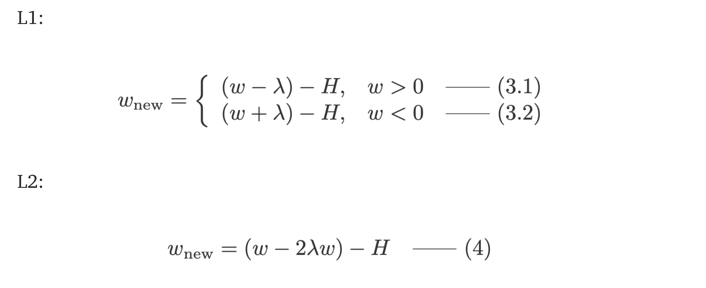

# 对于正则化的理解
:::tip
 这篇文章主要介绍L1和L2正则化是如何在梯度下降中工作的；>
 越往后学越意识到基础知识的重要性，这些基础知识可能在你前期理解的时候会比较费劲，但是当你真正的想要去对神经网络进行设计的时候就会体会到他们的重要性.
:::

原文链接：https://towardsdatascience.com/intuitions-on-l1-and-l2-regularisation-235f2db4c261

过拟合是当前机器学习或统计模型针对特定数据集而无法推广到其他数据集时发生的现象。这通常发生在复杂的模型中，比如深度神经网络。

正则化是引入其他信息以防止过度拟合的过程。本文的重点是L1和L2正则化。

有很多解释，但老实说，它们有点太抽象了，我可能会忘记它们，最后访问这些页面，只是再次忘记。在本文中，我将通过梯度下降来解释为什么L1和L2起作用。梯度下降只是一种通过使用梯度值的迭代更新来找到 “正确” 系数的方法。(本文展示了如何在简单的线性回归中使用梯度下降。)

## L1和L2是什么？

L1和L2正则化分别归因于向量w的L1和L2范数。下面有关范数的基础知识：

 1-norm (also known as L1 norm)：
$$
\|\mathbf{w}\|_{1}=\left|w_{1}\right|+\left|w_{2}\right|+\ldots+\left|w_{N}\right|
$$
2-norm (also known as L2 norm or Euclidean norm)：
$$
\|\mathbf{w}\|_{2}=\left(\left|w_{1}\right|^{2}+\left|w_{2}\right|^{2}+\ldots+\left|w_{N}\right|^{2}\right)^{\frac{1}{2}}
$$
*p*-norm
$$
\|\mathbf{w}\|_{p}=\left(\left|w_{1}\right|^{p}+\left|w_{2}\right|^{p}+\ldots+\left|w_{N}\right|^{p}\right)^{\frac{1}{p}}
$$
实现L1范数进行正则化的线性回归模型称为`lasso regression`，实现 (平方) L2范数进行正则化的线性回归模型称为`岭回归`。线性回归的模型对于这两种范数的实现是一样的。
$$
\hat{y}=w_{1} x_{1}+w_{2} x_{2}+\ldots+w_{N} x_{N}+b
$$
但是在计算中损失函数包含这些正则项：

:::note
严格来说，最后一个方程 (岭回归) 是权重平方为L2范数的损失函数 (注意没有平方根)。
:::

正则化项是 “约束”，在最小化损失函数时，优化算法必须通过该约束来 “坚持”。

### Model

让我们定义一个模型，看看L1和L2是如何工作的。为简单起见，我们用一个自变量定义了一个简单的线性回归模型。
$\hat{y}=w x+b$
在这里，我使用了深度学习中的约定w ('weight ') 和b ('bias')。

> 在实际应用中，简单的线性回归模型不容易出现过拟合。如引言中所述，深度学习模型由于其模型复杂性而更容易出现此类问题。
>
> 因此，请注意，本文中使用的表达式很容易扩展到更复杂的模型，而不仅限于线性回归。

### 损失函数

为了证明L1和L2正则化的效果，让我们使用3种不同的损失函数/目标拟合我们的线性回归模型。

我们的目标是尽量减少这些不同的损失。

#### 无正则化的损失函数

我们将损失函数L定义为平方误差，其中误差是y (真实值) 和 (预测值) 之间的差。
$$
\begin{aligned}
L &=(\hat{y}-y)^{2} \\
&=(w x+b-y)^{2}
\end{aligned}
$$
让我们假设我们的模型将使用此损失函数进行过拟合。

#### 具有L1正则化的损失函数

根据上述损失函数，在其上添加一个L1正则化项如下所示:
$$
L_{1}=(w x+b-y)^{2}+\lambda|w|
$$
其中正则化参数 λ> 0是手动调节的。我们把这个损失函数叫做L1。请注意，除了w = 0时，| w | 在任何地方都是可微的，如下所示。我们以后会需要这个。

$$
\frac{d|w|}{d w}=\left\{\begin{array}{ll}
1 & w>0 \\
-1 & w<0
\end{array}\right.
$$

#### 具有L2正则化的损失函数

同样，将L2正则化项添加到L看起来是这样的：
$L_{2}=(w x+b-y)^{2}+\lambda w^{2}$
同样，λ> 0。

#### 梯度下降

现在，让我们根据上面定义的3个损失函数，使用梯度下降优化来求解线性回归模型。回想一下，更新梯度下降中的参数w如下:
$w_{\text {new }}=w-\eta \frac{\partial L}{\partial w}$

让我们用L，L1和L2的梯度替换上式中的最后一项

L:
$$
\begin{aligned}
w_{\text {new }} &=w-\eta \frac{\partial L}{\partial w} \\
&=w-\eta \cdot[2 x(w x+b-y)]
\end{aligned}
$$

$L1:$
$$
\begin{aligned}
w_{\text {new }} &=w-\eta \frac{\partial L_{1}}{\partial w} \\
&=w-\eta \cdot\left[2 x(w x+b-y)+\lambda \frac{d|w|}{d w}\right] \\
&=\left\{\begin{aligned}
w-\eta \cdot[2 x(w x+b-y)+\lambda] & w>0 \\
w-\eta \cdot[2 x(w x+b-y)-\lambda] & w<0
\end{aligned}\right.
\end{aligned}
$$

$L2:$
$$
\begin{aligned}
w_{\text {new }} &=w-\eta \frac{\partial L_{2}}{\partial w} \\
&=w-\eta \cdot[2 x(w x+b-y)+2 \lambda w]
\end{aligned}
$$

## 如何避免过拟合

从这里开始，让我们对上面的方程式进行以下替换 (以获得更好的可读性):

- $\eta=1$
- $H=2 x(w x+b-y)$

接着我们就可以得到：

L:
$$
w_{\text {new }}=w-H 
$$
L1:
$$
w_{\text {new }}=\left\{\begin{array}{ll}
(w-H)-\lambda, & w>0 \\
(w-H)+\lambda, & w<0
\end{array}\right.
$$
$L2:$

$$
w_{\text {new }}=(w-H)-2 \lambda w 
$$

###  有正则化与没有正则化

观察有正则化参数 λ 和没有正则化参数 λ 的权重更新之间的差异。这里有一些地方可以很直观的看出。

Intuition A：

假设用等式0，计算w-H给我们一个w值，导致过拟合。然后，直觉上，公式将减少过拟合的机会，因为引入 λ 使我们远离了前面说过的由于w导致的过拟合问题。

Intuition B：

一个过度拟合的模型意味着我们有一个非常适合我们模型的w值。“完美” 的意思是，如果我们将数据 (x) 替换回模型中，我们的预测将非常非常接近真实的y。当然，这很好，但是我们不想要完美。为什么？因为这意味着我们的模型仅适用于我们训练的数据集。这意味着我们的模型将产生与其他数据集的真实值相去甚远的预测。因此，我们满足于不那么完美，希望我们的模型也能与其他数据进行接近的预测。为此，我们用惩罚项 λ 在等式0中 “taint” 这个完美的w。就如公式15和16所示。

Intution C：

请注意，H 取决于模型 (w和b) 和数据 (x和y)。仅根据公式中的模型和数据更新权重会导致过拟合，从而导致模型泛化性不好。另一方面，在等式15，16中，w的最终值不仅受模型和数据的影响，而且还受与模型和数据无关的预定义参数 λ 的影响。因此，尽管值过大会导致模型严重欠拟合，如果我们设置适当的 λ 值就可以防止过拟合。

Intution D：

不同潜在训练集的权重会更相似——这意味着模型的方差减少了（相反，如果我们每次随机移动权重只是为了摆脱过度拟合的解决方案，方差不会改变）。

我们将为每个功能提供更小的权重。为什么这会减少过度拟合？我觉得很容易思考的方式是，在典型情况下，我们将有少量简单的特征，这些特征将解释大部分方差 (例如，y的大部分将由y_hat = ax+b解释); 但是如果我们的模型没有正则化，我们可以添加我们想要的更多功能来解释数据集的残差方差 (例如y_at = ax+bx ²+ cx ³ + e)，这自然会使得模型过度拟合训练。引入权重之和的惩罚意味着模型必须最佳地 “分配” 其权重，因此自然地，该 “资源” 的大部分将用于解释大部分方差的简单特征，而复杂特征的权重很小或为零。

### L1 vs L2

比较上面每个等式的第二项。除H外，w的变化取决于 ± λ 项或-2λw项，这突出了以下内容的影响:

1. sign of current *w* (L1, L2)
2. magnitude of current *w* (L2)
3. doubling of the regularisation parameter (L2)

虽然使用L1的权重更新会受到第一点的影响，但来自L2的权重更新受所有这三个点的影响。虽然我只是根据迭代方程更新进行了比较，但请注意，这并不意味着一个比另一个 “更好”。

现在，让我们在下面看看如何仅通过当前w的符号就可以实现L1的正则化效应。

### L1的稀疏性

看看方程3.1中的L1。如果w为正，则正则化参数 λ>0将通过从w中减去 λ 来让w更小。相反，在等式3.2中，如果w为负，则 λ 将被加到w上，从而使其较少为负。因此，这具有将w推向0的效果。

这在1元线性回归模型中当然毫无意义，但其具有在多元回归模型中 “去除” 无用变量的能力。你也可以认为L1完全减少了模型中的特征数量。以下是L1试图在多元线性回归模型中 “推” 一些变量的示例：
$\hat{y}=0.4561 x_{1}-0.0007 x_{2}+0.3251 x_{3}+0.0009 x_{4}+0.0001 x_{5}-0.9142 x_{6}-0.553$
那么，将w推向0如何有助于L1正则化中的过拟合？如上所述，随着w变为0，我们正在通过降低变量的重要性来减少功能的数量。在上面的方程式中，我们看到x_2，x_4和x_5由于系数小而几乎 “无用”，因此我们可以将它们从方程式中删除。这反过来降低了模型的复杂性，使我们的模型更简单。更简单的模型可以减少过拟合的机会。

Note：

虽然L1具有将权重推向0的影响，而L2没有，但这并不意味着由于L2的权重不能达到或者接近0。

