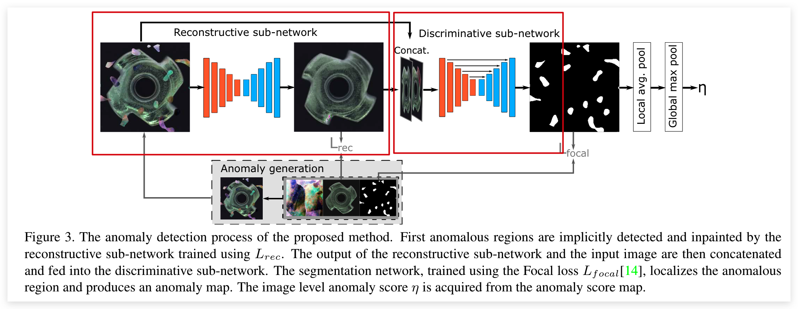
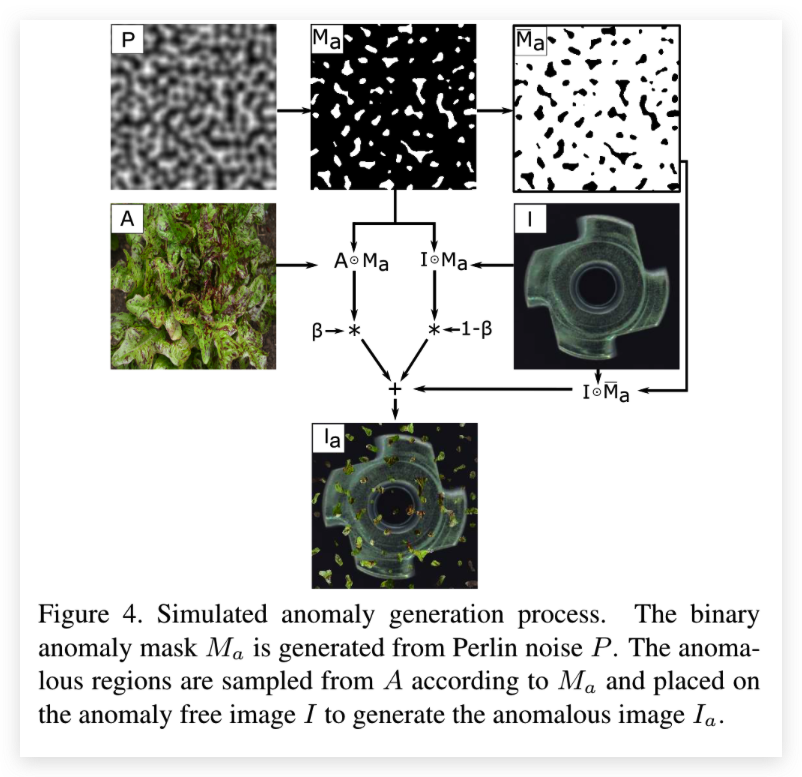
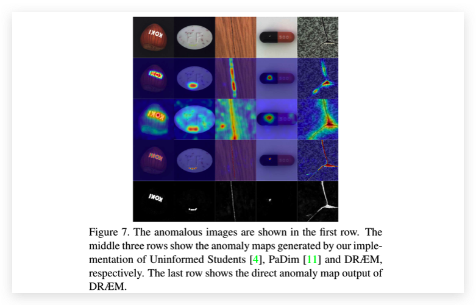

# DRAEM: Surface Anomaly Detection Network

:::note
DRÆM – A discriminatively trained reconstruction embedding for surface anomaly detection
:::

## BackGround

Visual surface anomaly detection aims to detect local image regions that significantly deviate from normal appearance.

## Related Work

Recent surface anomaly detection methods rely on generative models to accurately reconstruct the normal areas and to fail on anomalies. These methods are trained only on anomaly-free images, and often require hand-crafted post-processing steps to localize the anomalies, which prohibits optimizing the feature extraction for maximal detection capability.

## Paper's Key Idea

This paper casts surface anomaly detection primarily as **a discriminative problem** and proposes a discriminatively trained reconstruction anomaly embedding model (DRAEM).

:::tip
In simple words, a discriminative model makes predictions on the unseen data based on conditional probability and can be used either for classification or regression problem statements. 
:::

The proposed method **learns a joint representation of an anomalous image** and its anomaly-free reconstruction, while simultaneously learning a decision boundary between normal and anomalous examples. The method enables direct anomaly localization without the need for additional complicated post-processing of the network output and **can be trained using simple and general anomaly simulations.**

### DRAEM

DRAEM is composed from a reconstructive and a discriminative sub-networks. The reconstructive sub-network is trained to implicitly detect and reconstruct the anomalies with semantically plausible anomaly-free content, while keeping the non-anomalous regions of the input image unchanged. Simultaneously, the discriminative sub-network learns a joint reconstruction-anomaly embedding and produces accurate anomaly segmentation maps from the concatenated reconstructed and original appearance.

  

#### Reconstructive sub-network

The reconstructive sub-network is formulated as an **encoder-decoder architecture** that converts the local patterns of an input image into patterns closer to the distribution of normal samples. The network is trained to reconstruct the original image $I$ from an **artificially corrupted version** $I_{a}$ obtained by a simulator.

The reconstruction loss is defined as bellow:

$$
L_{r e c}\left(I, I_{r}\right)=\lambda L_{S S I M}\left(I, I_{r}\right)+l_{2}\left(I, I_{r}\right) \\
L_{S S I M}\left(I, I_{r}\right)=\frac{1}{N_{p}} \sum_{i=1}^{H} \sum_{j=1}^{W} 1-\operatorname{SSIM}\left(I, I_{r}\right)_{(i, j)},
$$

#### Discriminative sub-network

The discriminative sub-network uses U-Net-like architecture. The sub-network input $I_{c}$ is defined as **the channel-wise concatenation of the reconstructive subnetwork output $I_{r}$ and the input image $I$.** Due to the normality-restoring property of the reconstructive subnetwork, the joint appearance of $I$ and $I_{r}$ differs significantly in anomalous images, providing the information necessary for anomaly segmentation. In reconstruction-based anomaly detection methods anomaly maps are obtained using similarity functions such as SSIM to compare the original image to its reconstruction, however **a surface anomaly detection-specific similarity measure is difficult to hand-craft**. In contrast, the discriminative sub-network learns the appropriate distance measure automatically. The network outputs an anomaly score $\operatorname{map} M_{o}$ of the same size as $I$. **Focal Loss** $\left(L_{s e g}\right)$ is applied on the discriminative sub-network output to increase robustness towards accurate segmentation of hard examples.

#### Simulated anomaly generation

DRAEM does **not require simulations to realistically reflect the real anomaly appearance in the target domain**, but rather to generate **just-out-of-distribution appearances**, which allow learning the appropriate distance function to recognize the anomaly by its deviation from normality.

A noise image is generated by a Perlin noise generator to capture a variety of anomaly shapes and binarized by a threshod sampled uniformly at random into an anomaly map $M_a$.

The simulated anomaly genertion process is showed bellow:

  

## Conclusion

This paper proposed a discriminatively trained reconstruction anomaly embedding model. This network can locate the anomaly noise and reconstruct the anomaly-free image from the noised image.

  

