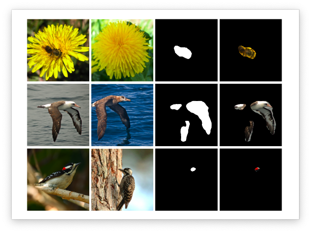

# SPADE: 基于特征金字塔子图像的异常检测

:::note
SPADE本身不是CVPR的工作，很早就挂在arxiv，但之后一直没有正式发表，最后与其他的创新点结合后在CVPR上发表: 论文：PANDA: Adapting Pretrained Features for Anomaly Detection and Segmentation (以色列,耶路撒冷希伯来大学)

但这篇文章其实跟SPADE方法本身关系不大了，要了解SPADE方法本身的话，最好参考下面这篇文章：

论文：Sub-Image Anomaly Detection with Deep Pyramid Correspondences

原文地址：https://arxiv.org/abs/2005.02357

代码地址：https://github.com/byungjae89/SPADE-pytorch?utm_source=catalyzex.com
:::


## 论文简介

SPADE的全称是 `Semantic Pyramid Anomaly Detection`, 这篇论文提出来了一个非常简单的异常检测和定位的方法，并达到了当时sota的精度。 SPADE 主要分为两个阶段，第一个阶段是异常检测（使用kNN算法结合距离函数去判断是否是异常图像），如果是异常图像则进行异常定位（计算每个像素的异常得分）。 SPADE也是将使用kNN的方法扩展到了像素级别的异常检测。

## 关键技术

### 特征提取

第一个阶段就是进行特征提取，SPADE直接使用别人预训练好的网络进行特征提取就好了（比如一个训练好的Resnet）。公式化的表达为 $f_i = F(x_i)$。

### KNN 异常图像判断

异常图像判断也是非常的简单，首先我们需要有一个需要预测的图片，然后会使用网络进行特征提取获取到训练集中前k个最相似的特征。接下来就计算一个距离 $d(y)$:

$$
d(y)=\frac{1}{K} \sum_{f \in N_{K}\left(f_{y}\right)}\left\|f-f_{y}\right\|^{2}
$$

这个 $d_y$ 其实也就是一个欧拉函数。后续我们就需要设置一个阈值，根据阈值来判断这是不是一个异常图片。SPADE进行异常图片判断的过程就是那么简单。

### 异常定位

#### 特征上的异常定位

通过检测正常的图像和异常图片像素的区别可以判断出异常的位置。但是最简单的方法（比如直接比较像素值），这样的方法有如下的三个问题：

1. 假设有多个正常的部分，在进行对齐的时候有可能会失败
2. 对于小型的数据集，很可能找不到与测试图片显示的图片
3. 比较图像之间的距离对于损失函数非常的敏感

为了解决上面的三个问题，文字提出了一个多图像相关的方法。具体的做法就是首先提取所有训练图像的特征，组成一个特征池。对于每一个位置的像素都有一个特征池，测试图片的每一个像素的异常得分就是就是与这个像素对应位置的特征池中距离最近的前k个元素的平均距离。

#### 特征金字塔匹配

为了能够同时获取细粒度和全局的特征，该篇的工作分别计算了Resnet中三个stage的特征的score map上采样之后concat了起来。 之后还做了一个高斯滤波的处理，下面贴下这部分计算的代码：

```python
score_map_list = []
for t_idx in tqdm(range(test_outputs['avgpool'].shape[0]), '| localization | test | %s |' % class_name):
	score_maps = []
	# 分别计算3个stage的score map
	for layer_name in ['layer1', 'layer2', 'layer3']:  # for each layer
		# 根据特征库给每一个像素选择前k个距离最近的特征
		topk_feat_map = train_outputs[layer_name][topk_indexes[t_idx]]
		test_feat_map = test_outputs[layer_name][t_idx:t_idx + 1]
		feat_gallery = topk_feat_map.transpose(3, 1).flatten(0, 2).unsqueeze(-1).unsqueeze(-1)

		# 计算距离矩阵
		dist_matrix_list = []
		for d_idx in range(feat_gallery.shape[0] // 100):
			dist_matrix = torch.pairwise_distance(feat_gallery[d_idx * 100:d_idx * 100 + 100], test_feat_map)
			dist_matrix_list.append(dist_matrix)
		dist_matrix = torch.cat(dist_matrix_list, 0)

		# k nearest features from the gallery (k=1)
		score_map = torch.min(dist_matrix, dim=0)[0]
		# 上采样到图像的大小
		score_map = F.interpolate(score_map.unsqueeze(0).unsqueeze(0), size=224,
									mode='bilinear', align_corners=False)
		score_maps.append(score_map)

	# 将每个stage得到的score map取均值
	score_map = torch.mean(torch.cat(score_maps, 0), dim=0)

	# 做一个高斯模糊
	score_map = gaussian_filter(score_map.squeeze().cpu().detach().numpy(), sigma=4)
	score_map_list.append(score_map)
```

下面放一些检测的效果图：

  

## 总结

这篇论文提出了一个简单但是有效的异常检测方法，方法简单，效果好。只使用固定的预训练网络提取特征，无需训练。 但是测试时，时间复杂度与数据量称线性关系，训练采用的正常图像越多，存储的特征也就越多，测试时的KNN复杂度越高。后续也有很多的算法对其进行改进。

 