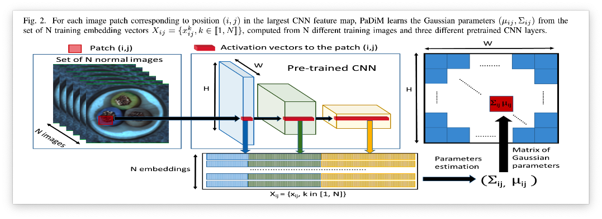
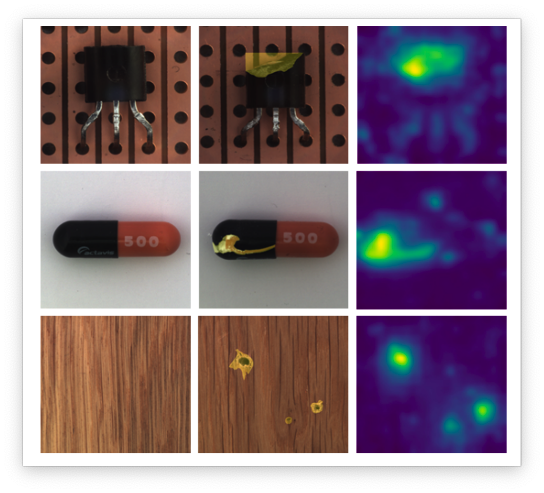

# PaDim: 用于异常检测和本地化的补丁分布建模框架

:::note
论文：PaDiM: a Patch Distribution Modeling Framework for Anomaly Detection and Localization（ICPR，CCF-C）

论文地址：https://arxiv.org/pdf/2011.08785.pdf

代码地址：https://github.com/xiahaifeng1995/PaDiM-Anomaly-Detection-Localization-master
:::

## 论文简介

这篇论文的思路其实就是对SPADE进行了速度上的优化。 由于SPADE是基于KNN去选择最重要的特征的，所以速度非常慢，而且是数据集越大越慢。PaDim将KNN这一步替换成了预测一个高斯分布。成功的提升了检测的速度，且达到了sota的检测精度。（除了改了高斯分布其他真的没有啥改的了，代码基本都没变）

## 关键技术

PaDim的核心过程如下所示：

  

### Embedding extraction

PaDim和SPADE提取Embedding的流程基本一致，都是对于不同stage的特征图进行提取后concat到一起。这样既能够提取细粒度的特征，也能够提取全局的特征。 PaDim还对特征的选取进行了优化，如果直接把所有的特征都纳入进来计算的话，计算量就会很大。所以PaDim随机选取100个特征（作者尝试了PCA和随机采样两种方法，但是效果都差不多）。 

### Learning of the normality

在经过上一步的特征提取的提取后，我们会获取到N个图像的特征图 $X_{ij}={x_{ij},k \in [1,N]}$，每个特征图都是由3个stage的特征图concat起来的。这里PaDim假设$X_{ij}$的特征是符合高斯分布的，所以用了一个高斯分布来模拟$X_{ij}$的分布。注意哦，在这样模拟分布之后就不用KNN那样重复的计算N次了，只需要对学习到的高斯分布图进行一次距离计算即可。这也是PaDim巧妙的地方，但是论文里面并没有对符合高斯分布的假设进行证明，所以是否真的符合高斯分布还是要打一个问号。 最后我们计算得到一个协方差矩阵，协方差矩阵的计算公式如下：

$$
\Sigma_{i j}=\frac{1}{N-1} \sum_{k=1}^{N}\left(\mathbf{x}_{\mathbf{i j}}^{\mathbf{k}}-\mu_{\mathrm{ij}}\right)\left(\mathbf{x}_{\mathbf{i j}}^{\mathbf{k}}-\mu_{\mathrm{i} \mathbf{j}}\right)^{\mathrm{T}}+\epsilon I
$$

### Computation of the anomaly map

在得到协方差矩阵后，PaDim使用曼哈顿距离作为每一个像素点的异常得分， 较高的得分（与正常数据的距离较大）。异常得分图的计算公式如下：

$$
M\left(x_{i j}\right)=\sqrt{\left(x_{i j}-\mu_{i j}\right)^{T} \Sigma_{i j}^{-1}\left(x_{i j}-\mu_{i j}\right)}
$$

  

## 总结

这是一篇主要从计算速度上去优化异常检测的论文，主要的创新点是引入了训练步骤(估计分布)，图像级的异常检测性能得到提升，并且大大减少了测试的复杂度。类似模板匹配的思想：为每个位置构造一个正常模板(分布)。

缺点是PaDiM为HxW个位置单独估计分布，但是每个位置上的像素并不是严格对齐的，比如screw这一类，每张训练图像的朝向都不一样。 而且Padim假设特征的分布是符合正态分布的，实际上特征的分布其实并不是完全符合一个正态分布。

