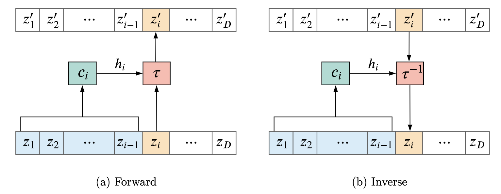
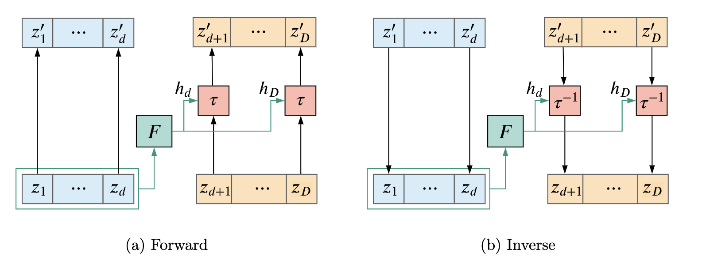
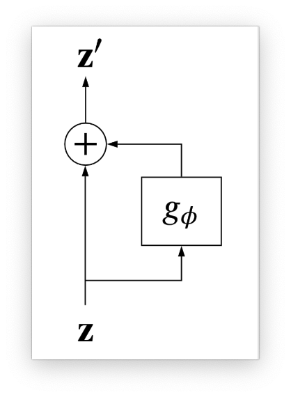

# NF 综述论文

:::tip

论文：Normalizing Flows for Probabilistic Modeling and Inference

论文地址：https://arxiv.org/abs/1912.02762

:::

## 标准化流的定义和基础

我们的目标是使用简单的概率分布来建立我们想要的更为复杂更有表达能力的概率分布，使用的方法就是Normalizing Flow，flow的字面意思是一长串的 $T$，即很多的transformation。让简单的概率分布，通过这一系列的 transformation，一步一步变成 complex、expressive的概率分布，like a fluid flowing through a set of tubes，fluid 就是说概率分布像水一样，是可塑的易变形的，我们把它通过一系列tubes，即变换 $T$ 们，塑造成我们想要的样子——最终的概率分布。下面开始使用的符号尽量与原论文保持一致。

### Normalizing Flow’s properties

假设有一变量 $\mathbf{u}$, 服从分布 $\mathbf{u} \sim p_u(\mathbf{u})$, 有一变换 $T, \mathbf{x}=T(\mathbf{u}), p_u(\mathbf{u})$ 是已知的一种简单分 布, 变换 $T$ 可逆, 且 $T$ 与 $T^{-1}$ 都可微分。 对于一个 Normalizing Flow 来说 $\mathbf{x}$ 和 $\mathbf{u}$ 需要满足下面的性质：

1、$\mathbf{x}$ 与 $\mathbf{u}$ 必须维度相同，因为只有维度相同，下面的变换 $T$ 才可能可逆

2、变换 $T$ 必须可逆，且 $T$ 和 $T$ 的逆必须可导

3、变换 $T$ 可以由多个符合条件2的变换 $T_i$ 组合而成

从使用角度来说，一个flow-based model提供了两个操作，一是sampling，即从分布 $p_u(\mathbf{u})$ 中 sample 出 $\mathbf{u}$。 $\mathbf{u}$ 经过变换后可以得到 $\mathbf{x}$, $\mathbf{x}=T(\mathbf{u})$ where $\mathbf{u} \sim p_u(\mathbf{u})$。 另一个就是 evaluate 模型的概率分布， 使用公式 $p_{\mathrm{x}}(\mathbf{x})=p_{\mathrm{u}}\left(T^{-1}(\mathbf{x})\right)\left|\operatorname{det} J_{T^{-1}}(\mathbf{x})\right|$ （基于 change of variable 理论）。

### Flow-based Models 有多强的表达能力？

我们知道 $p_u(\mathbf{u})$ 是很简单的一个概率分布，那么通过 flow，我们能将 $p_u(\mathbf{u})$ 转换为任意的概率分布 $p_x(\mathbf{x})$ 吗？ 假设x为D维向量, $p_x(\mathbf{x}) > 0$, $x_i$ 的概率分布只依赖 i 之前的元素 $x_{<i}$ , 那么可以将 $p_x(\mathbf{x})$ 分解为条件概率的乘积。

$$
p_{\mathrm{x}}(\mathbf{x})=\prod_{i=1}^D p_{\mathrm{x}}\left(\mathbf{x}_i \mid \mathbf{x}_{<i}\right)
$$

假设变换 $F$ 将 $\mathbf{x}$ 映射为 $\mathbf{z}$, $\mathbf{z_i}$ 的值由 $\mathbf{x_i}$ 的累积分布函数(cdf)确定：

$$
\mathrm{z}_i=F_i\left(\mathrm{x}_i, \mathbf{x}_{<i}\right)=\int_{-\infty}^{\mathrm{x}_i} p_{\mathrm{x}}\left(\mathrm{x}_i^{\prime} \mid \mathbf{x}_{<i}\right) d \mathrm{x}_i^{\prime}=\operatorname{Pr}\left(\mathrm{x}_i^{\prime} \leq \mathrm{x}_i \mid \mathbf{x}_{<i}\right)
$$

很明显 $F$ 是可微分的， 其微分就等于 $p_x(\mathbf{x_i}| \mathbf{x}_{<i})dx_i'$, 由于 $F_i$ 对 $x_j$ 的偏微分当 j > i 时等于0，因此 $J_F(\mathbf{x})$ 是一个下三角矩阵，那么其行列式就等于其对角线元素的乘积，即：

$$
\operatorname{det} J_F(\mathbf{x})=\prod_{i=1}^D \frac{\partial F_i}{\partial \mathbf{x}_i}=\prod_{i=1}^D p_{\mathrm{x}}\left(\mathbf{x}_i \mid \mathbf{x}_{<i}\right)=p_{\mathrm{x}}(\mathbf{x})>0
$$

因为 $p(x) > 0$ 所以， 雅克比行列式也大于0， 因此变换 $F$ 的逆必然存在，结合 change of variable 理论，我们可以得到：

$$
p_z(\mathbf{z})=p_x(\mathbf{x})\left|\operatorname{det} J_F(\mathbf{x})\right|^{-1}=1
$$

即 $\mathbf{z}$ 是D维空间中 (0,1) 之间的均匀分布。

上述对 $p(x)$ 的限制仅仅是 $x_i$ 依赖于 $x_{<i}$ 的条件概率对 $(x_i, x_{<i})$ 可微， 且 $p_x(\mathbf{x})> 0 \ \forall \mathbf{x} \in \mathbb{R}^D$，我们就使用变换 $F$ 将 其变成了最简单的0-1均匀分布，由因为 $F$ 可逆，所以我们可以用 $F^{-1}$ 将 $p_z(\mathbf{z})$ 转换为任意满足上述条件的概率分布 $p_x(\mathbf{x})$，也可以使用变换 G 将任意的概率分布 $p(x)$ 转换为 $p(u)$, 再用 $F^{-1}$ 将 $p_z(\mathbf{z})$ 转换为任意分布的 $p_x(\mathbf{x})$ 。

## 有限组合的变换

我们通过组合 K 个 transformation 得到 T 变换，令 $\mathbf{z_0}=\mathbf{u}$, $\mathbf{z_K}=\mathbf{x}$。

$$
\begin{aligned}
T &=T_K \circ \cdots \circ T_1 \\
\mathbf{z}_k &=T_k\left(\mathbf{z}_{k-1}\right) \text { for } k=1: K \\
\mathbf{z}_{k-1} &=T_k^{-1}\left(\mathbf{z}_k\right) \text { for } k=K: 1 \\
\log \left|J_T(\mathbf{z})\right| &=\log \left|\prod_{k=1}^K J_{T_k}\left(\mathbf{z}_{k-1}\right)\right|=\sum_{k=1}^K \log \left|J_{T_k}\left(\mathbf{z}_{k-1}\right)\right|
\end{aligned}
$$

我们可以将每个 $T_k$ 或 $T_k^{-1}$ 都设为一个参数为 $\phi_k$ 的神经网络, 下面用 $f_{\phi_k}$ 来统一表示这两者, 但 是这带来的问题是, 我们必须保证该神经网络是可逆的, 并且能够容易计算, 否则, 上述的 正向 $\mathrm{KL}$ 散度需要变换 $T_k$ 来做sampling, 逆向 $\mathrm{KL}$ 散度需要 $T_k^{-1}$ 来evaluating desity, 如果变 换 $f_{\phi_k}$ 的逆不存在或不易求, 则density evaluation或sampling将是效率极低的, 甚至无法 处理的。至于是否要求 $f_{\phi_k}$ 有高效的求逆方法、 $f_{\phi_k}$ 到底是使用 $T_k$ 还是 $T_k^{-1}$, 则由具体的使用目 的决定。下面忽略下标 $\mathrm{k}$, 使用 $f_\phi$ 表示神经网络, $\mathrm{x}$ 表示输入, $\mathrm{z}$ 表示输出。

### 自回归流 Autoregressive flows

我们知道了在合理的情况下，我们可以使用一个下三角雅可比矩阵将任意的概率分布 $p_x(\mathbf{x})$ 变换为均匀分布，自回归流就是这样的一种构建方法。

$$
\mathrm{z}_i^{\prime}=\tau\left(\mathrm{z}_i ; \boldsymbol{h}_i\right) \quad \text { where } \quad \boldsymbol{h}_i=c_i\left(\mathbf{z}_{<i}\right)
$$

$\tau$ 就是我们的 Transformer, $c_i$ 是第 $\mathrm{i}$ 个 conditioner, 该变换是严格单调函数, 因此必可逆。 变换 $\tau$ 的参数为 $h_i, h_i$ 是由 conditioner 决定的, 用来描述当输入的 $\mathbf{z}_i$ 变化时, 输出 $\mathbf{z}_i^{\prime}$ 会如何变化。 conditioner 唯一的限制就是它只能将 $\mathbf{z}_{<i}$ 作为输入，因此它可以是任意一个复杂的神经网络, 不必关心是否可逆等问题。因此, 可以看出, $f_\phi$ 的参数 $\phi$ 其实就是conditioner的参数, 但有时变换 $\tau$ 也有它自己的额外参数 (除了 $\left.h_i\right) \circ$ 上述变换的逆变换为:

$$
\mathrm{z}_i=\tau^{-1}\left(\mathrm{z}_i^{\prime} ; \boldsymbol{h}_i\right) \quad \text { where } \quad \boldsymbol{h}_i=c_i\left(\mathbf{z}_{<i}\right)
$$

在正向计算中, 因为输入 $\mathbf{z}$ 是完全已知的, 那么所有的 $h_i$ 可以同时一次性求出来, 因此 $\mathbf{z}^{\prime}$ 也可以同时求出来, 但是在求逆变换的计算时, 要计算 $\mathbf{z}_i$ 前必须先把 $\mathbf{z}_{<i}$ 都计算出来, 因为 $\mathbf{z}_{<i}$ 是 $h_i$ 的输入。很明显, 自回归流的雅可比矩阵是下三角形的, 因为任意的 $\mathbf{z}_i^{\prime}$ 都不依赖 $\mathbf{z}_{>i}$, 那么 $\mathbf{z}_{\leq i}^{\prime}$ 关于 $\mathbf{z}_{>i}$ 的偏导都为 0 , 因此雅可比矩阵可写为：

$$
J_{f_\phi}(\mathbf{z})=\left[\begin{array}{ccc}
\frac{\partial \tau}{\partial z_1}\left(z_1 ; \boldsymbol{h}_1\right) & & \mathbf{0} \\
& \ddots & \\
\mathbf{L}(\mathbf{z}) & & \frac{\partial \tau}{\partial z_D}\left(\mathrm{z}_D ; \boldsymbol{h}_D\right)
\end{array}\right]
$$

它的行列式就是对角线元素乘积, 因此也非常好求

$$
\log \left|\operatorname{det} J_{f_\phi}(\mathbf{z})\right|=\log \left|\prod_{i=1}^D \frac{\partial \tau}{\partial \mathrm{z}_i}\left(\mathrm{z}_i ; \boldsymbol{h}_i\right)\right|=\sum_{i=1}^D \log \left|\frac{\partial \tau}{\partial \mathrm{z}_i}\left(\mathrm{z}_i ; \boldsymbol{h}_i\right)\right|
$$

  

### 各种Transformer $\tau$ 的实现

#### 仿射自回归流(Affine autoregressive flows)

令 $\tau$ 为下式 ：

$$
\tau\left(\mathrm{z}_i ; \boldsymbol{h}_i\right)=\alpha_i \mathrm{z}_i+\beta_i \quad \text { where } \quad \boldsymbol{h}_i=\left\{\alpha_i, \beta_i\right\}
$$

只要 $\alpha_i$ 不为 0 , $\tau$ 变换的逆就存在, 我们可以令 $\alpha_i=\exp \left(\tilde{\alpha_i}\right)$, 这样 $\tilde{\alpha_i}$ 就是一个不受限制的参数 了, 该变换的雅可比行列式为

$$
\log \left|\operatorname{det} J_{f_\phi}(\mathbf{z})\right|=\sum_{i=1}^D \log \left|\alpha_i\right|=\sum_{i=1}^D \tilde{\alpha}_i
$$

仿射自回归流虽然很简单, 但它的一大缺点是表达能力受限(Iimited expressivity), 假如 $z$ 属于高斯分布, 那么 $z^{\prime}$ 也必属于高斯分布, 但可以通过堆叠多个仿射变换来增强表达能力, 但仿射自回归流是否是一个普遍的概率分布近似器就末知了。

#### 非仿射神经网络变换 (Non-affine neural network transformers)

$$
\tau\left(\mathrm{z}_i ; \boldsymbol{h}_i\right)=w_{i 0}+\sum_{k=1}^K w_{i k} \sigma\left(\alpha_{i k} \mathrm{z}_i+\beta_{i k}\right) \quad \text { where } \quad \boldsymbol{h}_i=\left\{w_{i 0}, \ldots, w_{i K}, \alpha_{i k}, \beta_{i k}\right\}
$$

不像上面连续使用 $K$ 次变换, 而是直接使用 $K$ 个单调增函数 $\sigma(\cdot)$ 的雉组合(conic combinations), $\mathrm{h}$ 中的参数皆大于0。其实就是给仿射变换加上一个`激活函数`, 再`线性组合` K种不同参数下的结果。一般使用反向传播优化参数, 缺点是该变换往往不可逆, 或者只能不断迭代求逆。

#### 积分变换(Integration-based transformers)

$$
\tau\left(\mathrm{z}_i ; \boldsymbol{h}_i\right)=\int_0^{\mathrm{z}_i} g\left(\mathrm{z} ; \boldsymbol{\alpha}_i\right) d \mathrm{z}+\beta_i \quad \text { where } \quad \boldsymbol{h}_i=\left\{\boldsymbol{\alpha}_i, \beta_i\right\}
$$

$g\left(\cdot ; \alpha_i\right)$ 可以是任意的正值神经网络, 导数很好求, 就是 $g\left(\mathbf{z}_i ; \alpha_i\right)$, 但积分缺乏 analytical tractability, 一种解决方法是让 $g$ 为一个 $2 L$ 次的正多项式, 积分结果就是关于 $\mathbf{z}_i$ 的 $2 \mathrm{~L}+1$ 次的 多项式, 由于任意的 $2 L$ 次多项式可以写为多个 $L$ 次多项式的平方之和, 我们可以定义 $\tau$ 为 $K$ 个 $L$ 次多项式平方之和的积分, 如下

$$
\tau\left(\mathrm{z}_i ; \boldsymbol{h}_i\right)=\int_0^{\mathrm{z}_i} \sum_{k=1}^K\left(\sum_{\ell=0}^L \alpha_{i k \ell} \mathrm{z}^{\ell}\right)^2 d \mathrm{z}+\beta_i
$$

参数 $\alpha$ 不受限制, 仿射变换为 $L=0$ 时的特例。由于5次及以上的方程没有根式解, 因此当 $L>=2$ 时, $2 L+1>=5$, 则无法直接求 $\tau^{-1}$, 只能使用二分搜索迭代求解。

### 各种 conditioner $c$ 的实现

虽然 $c_i$ 可以是任意复杂的函数，比如神经网络，但每个 $z_i$ 都有一个 $c_i$ 的话，计算量和内存占用太大，解决的办法是参数共享。

#### 循环自回归流(Recurrent autoregressive flows)

一种 Conditioner 参数共享的方法是使用循环神经网络RNN/GRU/LSTM来实现:

$$
\begin{array}{ll}
\boldsymbol{h}_i=c\left(\boldsymbol{s}_i\right) \text { where } & s_1=\text { initial state } \\
& \boldsymbol{s}_i=\operatorname{RNN}\left(\mathrm{z}_{i-1}, \boldsymbol{s}_{i-1}\right) \text { for } i>1
\end{array}
$$

RNN 被广泛用于在自回归模型条件分布中去共享参数。基于 RNN 的自回归模型有很多应用比如，分布估计，序列模型（NLP相关），视频/图像生成（[PixelRNN[1]](https://arxiv.org/abs/1601.06759), [VidePixelRNN[2]](https://arxiv.org/abs/1610.00527)）。

在基于自回归流的 Flow 模型中，RNN 也被用于去共享参数，比如 Oliva et al. (2018) [4]、Kingma et al. (2016) [5]，但是其相关的研究确比较少（我猜可能是效果不太好，RNN 不是太适合这个任务？）。 这种方法的主要缺点是计算不再能并行化, 因为计算 $s_i$ 必须先计算 $s_{i-1}$, 当如理高维数据, 比如图片、视频时会很慢。

#### 掩码自回归流(Masked autoregressive flows)

另一种参数共享，但是不依赖 RNN 的方式是通过 mask 来实现的。 这种方法使用一个单一，经典的前馈神经网络来实现 conditioner, 将 $\mathbf{z}$ 作为输入， 一次性输出整个序列 $h_1,...,h_D$ 。唯一的要求是这个网络必须服从 conditioner 的自回归结构：$h_i$ 不能依赖 $z_{>=i}$。

为了让 $h_i$ 不能依赖 $\mathbf{z}_{>=i}$, 可以通过将神经网络中这些连接给去掉, 方式是给矩阵中这些位置乘上0, 就像「Transformer」中的 self-attention 在计算 softmax 时用负无穷 mask 掉上三角的注意力权重, 达到 future blind 的目的。但该方法的一大缺点是求逆时的计算量是正向计算的D倍（**但是这种缺点对于只需要正向的应用来说就不存在**）。

上面的计算过程是: 开始不知道 $z$, 随机初始化一个, 但是 $z_0$ 是任意的, 也就是我们可以直接得到 $\mathrm{h}_1$, 然后用 $z_1^{\prime}$ 与它计算出 $z_1$, 纠正随机初始化的 $z$ 的第 1 个元素, 之后以此类推, 第 $D$ 次迭代后, $z$ 被完全纠正。Masked conditioner 每次只能使用 $z(<\mathrm{i})$, 即只能计算出$h_i$。开始直接能得到$h_1$ , 计算出 $z_1$ 后, 再让 $z_1$ 通过 conditioner 函数得到 $h_2$ , 再用公式计算 $z_2$, 以此类推。这里一共计算了 $D$ 次 $c$, 而在正向计算时只用一次, 求逆时计算代价是正向的 D 倍, 对高维数据来说无法接受。一种解决办法是类似于牛顿法的更新公式(我们要求使 $f(z)=z^{\prime}$ 成立的 $z$, 即求 $g(z)=f(z)-z^{\prime}$ 的零点, 那么更新公式 $z=z-a * g(z) / g^{\prime}(z)=z-a *$ $\left.\left(f(z)-z^{\prime}\right) / J\right)$

$$
\mathbf{z}_{k+1}=\mathbf{z}_k-\alpha \operatorname{diag}\left(J_{f_\phi}\left(\mathbf{z}_k\right)\right)^{-1}\left(f_\phi\left(\mathbf{z}_k\right)-\mathbf{z}^{\prime}\right)
$$

我们使用 $\mathbf{z}^{\prime}$ 初始化 $\mathbf{z}_0, f_\phi^{-1}\left(\mathbf{z}^{\prime}\right)$ 是上式唯一的不动点, 一般 $0<\alpha<2$ 的情况下 $\mathbf{z}_k$ 最终会收敛到 某个局部最优点, 否则将发散。

掩码自回归流有两个主要的优点。首先它正向推理的速度很快，给定一个 $\mathbf{z}$, 参数 $h_1,...,h_D$ 可以用一个神经网络推理一次就得到。$z'$ 的每个维度都可以通过 $\mathrm{z}_i^{\prime}=\tau\left(\mathrm{z}_i ; \boldsymbol{h}_i\right)$ 并行计算得到（能并行计算在GPU上计算就很快）。第二点，掩码自回归是一个 universal approximator。 给定足够大的 conditioner 和足够灵活的 transformer，它们可以用单向的 Transformor 表示任何自回归变换，从而在任意两个分布之间变换。 **掩码自回归流的缺点是它的反向计算速度很慢。** 尽管掩码自回归流的反向计算速度很慢，但是其仍然是最流行的自回归Flow模型之一。

#### Coupling layers

Coupling layers  是将 $z$ 一分为二, 前 $d$ 个元素原封不动, $d+1 \sim D$  的元素依赖于前 $d$ 的元素, $h_1 \sim h_d$ 是常数, 不依赖于 $z, h_{d+1} \sim h_D$ 依赖于 $z<=d$, 计算公式类似上述几种方法

$$
\begin{aligned}
\mathbf{z}_{\leq d}^{\prime} &=\mathbf{z}_{\leq d} \\
\left(\boldsymbol{h}_{d+1}, \ldots, \boldsymbol{h}_D\right) &=\mathrm{NN}\left(\mathbf{z}_{\leq d}\right) \\
\mathbf{z}_i^{\prime} &=\tau\left(\mathbf{z}_i ; \boldsymbol{h}_i\right) \text { for } i>d
\end{aligned}
$$

其雅可比矩阵左上角 $d  d$ 是单位阵, 右下角 $(D-d) \times(D-d)$ 为对角矩阵, 其行列式即为右下角 对角矩阵的行列式, 即对角线乘积。

$$
J_{f_\phi}=\left[\begin{array}{ll}
\mathbf{I} & \mathbf{0} \\
\mathbf{A} & \mathbf{D}
\end{array}\right]
$$

虽然 Coupling Layers 的计算效率更高, 但表达能力受限, 但我们可以通过堆叠多个 coupling layer并在每层对 $z$ 的元素进行重新排列来解决这个问题, 比如第一层前 $d$ 个元素 被原封不动地copy, 后D-d个元素通过神经网络, 那第二层就原封不动地copy后D-d个元 素, 把前 $d$ 个元素通过神经网络, 如此交替多层,

  

Coupling Layer 和全自回归流是两种完全不同的实现。Coupling Layer 将 $\mathbf{z}$ 分为了两个部分，将一部分经过 $F$ 计算后得到的数值作为另一部分转换方程的函数（比如仿射变换的偏移量）。而全自回归流是将输入分为 D 个部分，$z_i$ 的转换依赖于 $z_{<i}$（图上很清楚的表示出来了）。

Coupling Layer 的优点是计算速度快，但是相对应的是让模型的表达能力受到了限制。与循环或Mask自回归流不同，单个的 Coupling Layer 不再能够表示任何自回归转换。因此在使用 Coupling Layer 的时候需要堆叠多个 Coupling Layer，每个 Coupling Layer 都对 $\mathbf{z}$ 的一部分进行转换。

Coupling Layer 由于其采样和密度估计的速度的过程都非常快，成为了目前最常用的变换函数。基于 Coupling Layer 的流可以用极大似然进行拟合，进而有效地进行采样。因此，Coupling Layer 经常用在图像、音频和视频等高维数据的生成模型中。

### Autoregression Model 和 Autoregressive Flow

除了归一化流（Autoregressive Flow），另一类流行的高维分布模型是自回归模型（Autoregression Model），现在我们讨论一下两者有什么关联。

为了建立自回归模型，我们首先将 $p_x(\mathbf{x})$ 定义为一维条件概率的乘积（使用链式法则）：

$$
p_{\mathrm{x}}(\mathbf{x})=\prod_{i=1}^D p_{\mathrm{x}}\left(\mathrm{x}_i \mid \mathbf{x}_{<i}\right)
$$

下面我们使用参数 $\mathbf{h}_i$ 对每个分布进行建模：

$$
p_{\mathbf{x}}\left(\mathbf{x}_i \mid \mathbf{x}_{<i}\right)=p_{\mathbf{x}}\left(\mathbf{x}_i ; \boldsymbol{h}_i\right), \quad \text { where } \quad \boldsymbol{h}_i=c_i\left(\mathbf{x}_{<i}\right)
$$

比如 $p_{\mathbf{x}}\left(\mathbf{x}_i ; \boldsymbol{h}_i\right)$ 可以是高斯分布的参数 $\mu_i$ 和 $\sigma_i$（均值和方差）。函数 $c_i$ 类似于自回归流的 conditioner，通常使用 Rnn 或掩码神经网络实现，如前几节所述。

那么自回归模型和自回归流有什么关系呢？我们可以将自回归模型看作是自回归流的一种特殊情况。所有的连续变量的自回归模型本质上都是具有单一自回归层的自回归流。综述论文里面还有对这块进行很详细的推导，有兴趣的可以去看原文

## 线性流 Linear Flows

在实践的过程中，基于Flow的模型有一个问题就是，一些目标变换可能更容易学习到，但是有一些变换就比较难学习到。这个问题在使用 Coupling Layer 的时候会被放大，因为其只会对一半的数据进行变换。这也是为什么 Coupling Layer 在处理的过程中需要将上下部分的数据进行调换，这样就可以保证数据的每个部分都能够被变换到。

为了解决这个问题，在实现的时候我们经常会使用 Permutation 操作：对输入的数据进行随机打乱。对于 Coupling Layer 这甚至是一个必要的操作。 Permute 需要是一个简单的可逆变换，同时其的 Jacobian 矩阵应该是1。Permutation 操作可以和可逆或者可微的变换相结合。 其中一种就是 Linear 变换。 Linear flow 本质上进行使用一系列的线性变换：

$$
\mathbf{z}^{\prime}=\mathbf{W} \mathbf{z}
$$

其中 $\mathbf{W}$ 是 $D \times D$ 的矩阵。这个变换的 Jacobian 矩阵是 $\mathbf{W}$，其行列式为1，所以是可逆的。Permutation 则是 Linear Flow 的一个简单版本（比如是 $\mathbf{W}$ 每行每列只有一个元素是1，其他元素都是0，当然了也有其他版本的 $\mathbf{W}$）

一种直觉上的优化方法就是将 Permutation 的 $\mathbf{W}$ 作为参数自动去学习。但是这样的方法是有问题的，首先生成的 $\mathbf{W}$ 不一定是可逆的，同时反向传播的时候相当于求解一个线性方程，时间复杂度是 $O(D^3)$，这样的时间复杂度是非常高的。所以在实现的时候，我们需要对 $\mathbf{W}$ 进行一些约束，比如我们可以限制 $\mathbf{W}$ 是一个上三角矩阵这样可以保证其的可逆性。

在自回归流中输出 $z_i$ 只依赖于 $z_{<=i}$, 但元素的排列顺序有时是对模型的学习有影响的，一种解决输入输入元素排列组合的方法是线性流，简单来说就是一个矩阵的变换：

$$
z' = \mathbf{W}\mathbf{z}
$$

雅克比矩阵就是 $\mathbf{W}$ 本身，我们需要保证 $\mathbf{W}$ 是可逆的，从而易于求逆和求解行列式

## 残差流 Residual Flows

残差流的计算公式如下：

$$
\mathbf{z}^{\prime}=\mathbf{z}+g_\phi(\mathbf{z})
$$

$g_\phi$ 是一个输出 D维向量的神经网络, 我们需要对其加以合适的限制, 以让其可逆。这个结构和残差结构有一些相似，这也是为什么我们把这一类的 Flow 模型叫做 Residual Flow。 Residual Transformation 并不总是可逆的，但是可以通过施加一些限制使其是可逆的。接下来，我们讨论设计可逆残差变换的两种一般方法:第一种是基于收缩映射（contractive maps）的，第二种是基于矩阵行列式引理（matrix determinant lemma）的。

  

### Contractive residual flows

构建满足 `Lipschitz` 连续条件，且 `Lipschitz` 常数小于1的变换$\mathbf{F}$

### Residual flows based on the matrix determinant lemma

$A$ 为 $D \times D$ 的可逆矩阵, $V 、 W$ 为 $D \times M$ 的矩阵, $M<D$, 有矩阵行列式引理如下

$$
\operatorname{det}\left(\mathbf{A}+\mathbf{V} \mathbf{W}^{\top}\right)=\operatorname{det}\left(\mathbf{I}+\mathbf{W}^{\top} \mathbf{A}^{-1} \mathbf{V}\right) \operatorname{det} \mathbf{A}
$$

如果 $\mathrm{A}$ 是对角阵的话计算量从左式的 $\mathcal{O}\left(D^3+D^2 M\right)$ 降到了 $\mathcal{O}\left(M^3+M^2 D\right)$

#### Planar flow 

Planar flow 是一个单层神经网络，只有一个神经元 w

$$
\begin{aligned}
\mathbf{z}^{\prime} &=\mathbf{z}+\mathbf{v} \sigma\left(\mathbf{w}^{\top} \mathbf{z}+b\right) \\
J_{f_\phi}(\mathbf{z}) &=\mathbf{I}+\sigma^{\prime}\left(\mathbf{w}^{\top} \mathbf{z}+b\right) \mathbf{v} \mathbf{w}^{\top} \\
\operatorname{det} J_{f_\phi}(\mathbf{z}) &=1+\sigma^{\prime}\left(\mathbf{w}^{\top} \mathbf{z}+b\right) \mathbf{w}^{\top} \mathbf{v}
\end{aligned}
$$

$\sigma$ 是一个可微的激活函数例如 $\tanh$, 假设 $\sigma^{\prime}$ 处处大于 0 , 且有上界 $S$, 则当 $\mathbf{w}^{\top} \mathbf{v}>-\frac{1}{S}$ 时, 雅 可比行列式大于 0

#### Sylvester flow

将 Planar flow 推广到有 M 个神经元 W 就是 Sylvester flow $, \mathbf{V} \in \mathbb{R}^{D \times M}, \mathbf{W} \in \mathbb{R}^{D \times M}$, $\mathbf{b} \in \mathbb{R}^M, \mathrm{~S}(\mathbf{z})$ 是对角矩阵, 元素是 $\sigma^{\prime}\left(\mathbf{W}^{\top} \mathbf{z}+\mathbf{b}\right)$ 的对角线上的元素

$$
\begin{aligned}
\mathbf{z}^{\prime} &=\mathbf{z}+\mathbf{V} \sigma\left(\mathbf{W}^{\top} \mathbf{z}+\mathbf{b}\right) \\
J_{f_\phi}(\mathbf{z}) &=\mathbf{I}+\mathbf{V S}(\mathbf{z}) \mathbf{W}^{\top} \\
\operatorname{det} J_{f_\phi}(\mathbf{z}) &=\operatorname{det}\left(\mathbf{I}+\mathbf{S}(\mathbf{z}) \mathbf{W}^{\top} \mathbf{V}\right)
\end{aligned}
$$

## 实现中的问题

实现 Flow 通常相当于在计算和内存允许的情况下组合尽可能多的转换（使用更多的流模块）。 比如 Glow 就使用了 320 个子模块，并使用了 40 个 GPU 进行训练。在实现这些网络非常深的模型时，会遇到一些问题，本节主要对这些问题进行介绍。

### Normalization 

与使用基于梯度的方法训练的深度神经网络一样，规范化中间的 $\mathbf{z_k}$ 对于在整个流中保持稳定的梯度至关重要。同时 BN 的 Jacobian 很容易计算，总而言之将 BN 作为流的一部分可以提高 Flow 模型的性能（$T_k \circ \mathrm{BN} \circ T_{k-1}$）。

### 多尺度结构

前面已经提到过，$\mathbf{x}$ 和 $\mathbf{u}$ 需要维持相同的大小，这样也会增加 $T$ 的计算量。RealNVP[5] 中提出了一种多尺度的结构：在进行 Flow 传播的过程中将某些维度分离出来，分离出来的部分不再进行额外的计算到末尾的时候再将分离的两部分合并起来。 RealNVP[5] 的作者同样也认为多尺度的结构更有利于训练。

## 参考文献

[1] Aaron van den Oord, Nal Kalchbrenner, & Koray Kavukcuoglu (2016). Pixel Recurrent Neural Networks international conference on machine learning.

[2] Nal Kalchbrenner, Aaron van den Oord, Karen Simonyan, Ivo Danihelka, Oriol Vinyals, Alex Graves, & Koray Kavukcuoglu (2016). Video Pixel Networks international conference on machine learning.

[3] Junier B. Oliva, Avinava Dubey, Manzil Zaheer, Barnabás Póczos, Ruslan Salakhutdinov, Eric P. Xing, & Jeff Schneider (2018). Transformation Autoregressive Networks international conference on machine learning.

[4] Durk P. Kingma, Tim Salimans, Rafal Jozefowicz, Xi Chen, Ilya Sutskever, & Max Welling (2016). Improved Variational Inference with Inverse Autoregressive Flow neural information processing systems.

[5] Laurent Dinh, Jascha Sohl-Dickstein, & Samy Bengio (2016). Density estimation using Real NVP Learning.