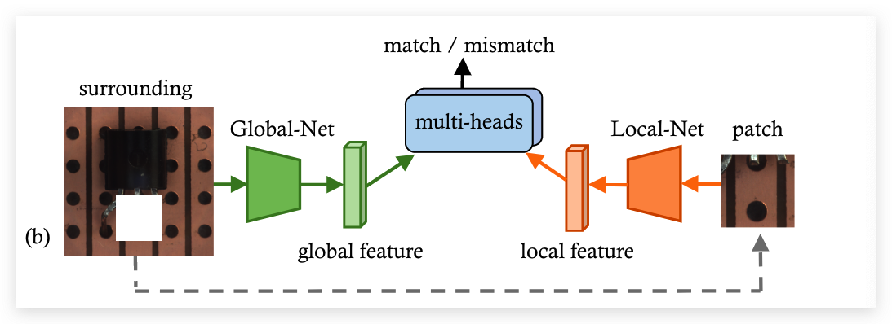
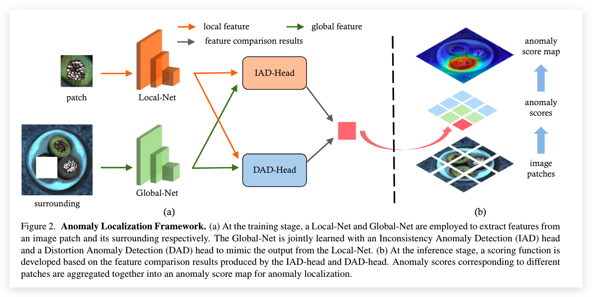

# Glancing: 基于全局和局部特征比较的异常定位

:::note
论文：Glancing at the Patch: Anomaly Localization with Global and Local Feature Comparison（CVPR2021）

论文地址：https://openaccess.thecvf.com/content/CVPR2021/papers/Wang_Glancing_at_the_Patch_Anomaly_Localization_With_Global_and_Local_CVPR_2021_paper.pdf
:::

## 论文简介

该篇论文提出了一种基于全局和局部特征比较的异常定位算法。具体来说就是有一个提取全局特征的网络Global-Net和提取局部特征的网络Local-Net，通过比较两个网络提取出来的特征的差距来进行异常检测和定位。流程如下图所示：

  

## 关键技术

### 局部和全局特征的提取

#### 局部特征提取

用于局部特征提取的网络是一个轻量级的网络 Local-Net。由于之前有很多的工作证明，在ImageNet上预训练的模型学习到的特征能够被用于异常检测。Local-Net 首先使用一个预训练的Resnet-18进行知识蒸馏，然后再在训练集上进行微调。 知识蒸馏的损失如下：

$$
l_{k}=\|\mathcal{D}(\mathcal{L}(\mathbf{p}))-\mathcal{R}(\mathbf{p})\|_{2}^{2}
$$

$\mathcal{L}$ 和 $\mathcal{R}$ 分别表示Local-Net和Teacher网络。 $|| \cdot ||$ 表示 l2 距离。除了知识蒸馏损失项之外还有一个损失项 $l_c$ 表示密度损失。

#### 全局特征提取

Global-Net被用来做全局特征的提取。Local-Net负责提取图像中一个Patch内容的特征，Global-Net就将把Patch部分遮住的图像作为输入。为了防止局部的特种干扰全局的特征，论文使用了局部卷积。 局部卷积的操作可以被如下定义：

$$
x^{\prime}= \begin{cases}\mathbf{W}^{\mathbf{T}}(\mathbf{X} \odot \mathbf{M}) \frac{\operatorname{sum}(\mathbf{1})}{\operatorname{sum}(\mathbf{M})}+b, & \text { if } \operatorname{sum}(\mathbf{M})>0 \\ 0, & \text { otherwise. }\end{cases}
$$

上面的公式中，$\odot$ 表示点积。 $\mathbf{X}$ 表示输入的特征图， $\mathbf{M}$是二值化的mask。对于没有一个pooling layer，特征图都会被normal pooling更新，同时 $\mathbf{M}$ 会更新为经过pooling之后的二值化mask。初始的时候 $\mathbf{M}_{\mathbf{0}}$ patch的地方是0其他的地方都是1。 这样是为了让 Global-Net 不看patch的内容也能够提取到全局的特征。

说了半天好像没说这个Global Net是如何训练的，下面介绍了异常检测头之后就可以介绍Global Net的训练过程了。

### 异常检测头

#### IAD-head

IAD-head（Inconsistency anomaly detection）被用来检测局部特征和全局特征的差距，其实就是计算局部特征和全局特征的l2距离。

$$
l_{\mathrm{IAD}}=\frac{1}{n}\left\|\mathbf{Z}_{l}-\mathbf{Z}_{g}\right\|_{2}^{2}
$$

这篇论文假设对于正常的图片，全局的特征和局部的特征是一致的。异常的图片local的特征和Global的特征就是不一样的。有了$l_{\mathrm{IAD}}$之后，就可以对Global-Net进行训练了，目的就是让全局特征和局部特征一致。

#### DAD-head

DAD-head是一个可训练的head，是用来检测图像中的扭曲的（弯曲的网格和切割的地毯）。相比聚焦于patch和其周围匹配的IAD-head，DAD-head则是用于定位patch中更加细节的异常。为了能够DAD-head能够有能力去区分正负patch，论文在训练过程中通过随机在patch上添加一些随机的小stain作为负样本。 

### 异常定位

#### 打分函数

在推理过程中将局部的特征和全局的特征送入到IAD-head当中去得到IAD score。

$$
s_{\mathrm{IAD}}=\frac{1}{n}\left\|\mathbf{Z}_{l}-\mathbf{Z}_{g}\right\|_{2}^{2}
$$

同样也会将局部特征和全局特征送入到DAD-head中得到异常得分：

$$
s_{\mathrm{DAD}}=1-\mathcal{C}\left(\mathbf{Z}_{l}, \mathbf{Z}_{g}\right)
$$

最后将两个得分加起来就是打分函数的最终公式：

$$
s=\lambda_{s} s_{\mathrm{IAD}}+\left(1-\lambda_{s}\right) s_{\mathrm{DAD}}
$$

#### Anomaly Score Map

通过打分函数我们可以得到一个patch区域的异常分数，通过将图像切分为一个个的小patch的方式就可以得到最终整幅图的Anomaly Score Map。结合下图可以更好的理解：

  

## 总结

这项工作中提出了一个无监督的异常定位方法，并充分考虑到全局和局部信息的图像。引入了两个异常检测，以充分发现全局和局部特征之间的差异。利用这种多头设计开发的评分函数，我们实现了高精度的异常定位，明显超过了最先进的替代方案。

但是这篇文章获取Anomaly Score Map的方式是通过将图片切分为一个一个的小patch进行的，这样的方式非常的低效。而且性能会受到patch大小的影响。同时本篇文章的Local Net是通过一个Resnet进行知识蒸馏得到的，使用自监督的方式在特定数据集上训练或许会更好。

