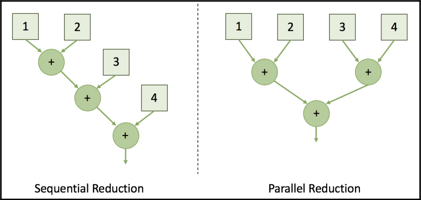
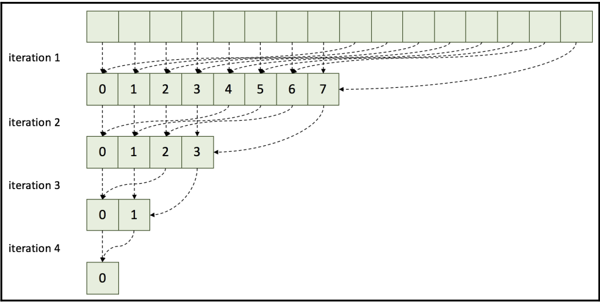
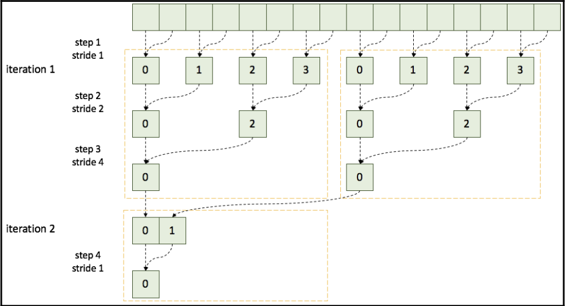

# CUDA 线程编程

在本文中我们将探讨CUDA的分层线程架构，这一架构使我们能够以组的形式管理CUDA线程，从而更好地控制GPU资源，实现高效的并行计算。

首先，让我们来了解CUDA线程的操作方式。在GPU上，线程可以以并行和并发的方式执行，形成所谓的"线程组"。这些线程组以warp的形式执行，利用内存带宽，同时处理控制开销和实现SIMD（Single Instruction, Multiple Data）操作，以提高计算效率。

- 分层CUDA线程操作
- 了解CUDA占用率
- 在多个CUDA线程之间共享数据
- 识别应用程序性能瓶颈
- 最小化CUDA warp分歧效应
- 提高内存利用率和网格跨距循环
- 利用协作组来灵活处理线程
- Warp同步编程
- 低/混合精度操作

## CUDA 的线程和块

在CUDA编程中，CUDA线程、线程块和GPU是基本的工作单位。CUDA编程的基本线程执行模型是单指令多线程（SIMT）模型。换句话说，核函数的主体是单个CUDA线程的工作描述。但是，CUDA架构会执行多个具有相同操作的CUDA线程。从概念上讲，多个CUDA线程在组内并行工作。CUDA线程块是多个CUDA线程的集合，多个线程块可以并发运行。我们将一组线程块称为一个网格。以下图表显示了它们之间的关系：

  


这些分层的CUDA线程操作与分层的CUDA架构相匹配。当我们启动一个CUDA核函数时，在GPU的每个多流处理器上执行一个或多个CUDA线程块。此外，多流处理器可以根据资源可用性运行多个线程块。线程块中的线程数和网格中的线程块数都会有所变化：

  


多流处理器以任意且并行的方式执行线程块，执行尽量多的线程块，以充分利用GPU资源。因此，可以并行执行的线程块数量会根据线程块所需的GPU资源和GPU资源的数量而变化。我们将在下一节中详细讨论这一点。多流处理器的数量取决于GPU的规格。例如，对于Tesla V100，它是80，而对于RTX 2080（Ti），它是48。

CUDA多流处理器以32个CUDA线程组成的一组来控制CUDA线程。这个组称为warp（线程束）。一个或多个warp组成一个CUDA线程块。以下图表显示了它们之间的关系：

  

小的绿色框代表CUDA线程，它们由warp组成。**warp是GPU架构的基本控制单元，因此其大小会隐式或明确地影响CUDA编程**。例如，最佳的线程块大小是在多个warp大小中确定的，这些大小可以充分利用线程块的warp调度和操作。我们称之为"占用率"，这将在下一节中详细介绍。此外，warp中的CUDA线程是并行工作的，并且具有同步操作，这是内在的。我们将在"线程束级别基元编程"部分讨论这一点。

现在，让我们看一下CUDA线程调度以及它们的隐式同步，使用CUDA的printf功能。并行CUDA线程的执行和线程块的操作是并行进行的。另一方面，从设备中打印输出是一个顺序任务。因此，我们可以很容易地看出它们的执行顺序，因为对于并行任务来说输出是任意的，对于并行任务来说输出是一致的。

我们将编写一个内核代码，用于打印全局线程索引、线程块索引、warp索引和通道索引。为此，代码可以编写如下：

```cpp
__global__ void index_print_kernel() {
  int idx = blockIdx.x * blockDim.x + threadIdx.x;
  int warp_idx = threadIdx.x / warpSize;
  int lane_idx = threadIdx.x & (warpSize - 1);
  if ((lane_idx & (warpSize/2 - 1)) == 0)
  printf(" %5d\t%5d\t %2d\t%2d\n", idx, blockIdx.x,
  warp_idx, lane_idx);
}
```

这段代码将帮助我们理解warp和CUDA线程调度的并发性。让我们编写调用内核函数的主机代码：

```cpp
int main() {
  int gridDim = 4, blockDim = 128;
  puts("thread, block, warp, lane");
  index_print_kernel<<< gridDim, blockDim >>>();
  cudaDeviceSynchronize(); 
}
```

最后，让我们编译代码，执行它，并查看结果：

```shell
nvcc -m64 -o cuda_thread_block cuda_thread_block.cu
```

以下结果是输出结果的一个示例。实际输出可能会有所不同：

```shell
$ ./cuda_thread_block.cu 4 128
thread, block, warp, lane
 64 0 2 0
 80 0 2 16
 96 0 3 0
 ...
 112 0 3 16
 0 0 0 0
 16 0 0 16
 ...
 352 2 3 0
 368 2 3 16
 288 2 1 0
 304 2 1 16
```

从结果中，您将看到CUDA线程以warp大小启动，顺序是不确定的。另一方面，通道输出是有序的。根据结果，可得如下内容：

- 无序的线程块执行：第二列显示了线程块的索引。结果表明，不保证按照块索引的顺序执行。
- 具有线程块的无序warp索引：第三列显示了块中warp的索引。warp的顺序在不同的块中变化。因此，我们可以推断没有warp执行顺序的保证。
- 在warp中以组的方式执行线程：第四列显示了warp中的通道。为了减少输出的数量，应用程序将其限制为仅打印两个索引。从每个warp内的有序输出中，我们可以推断printf函数的输出顺序是固定的，因此没有反转。

总结一下，**CUDA线程分为32个线程一组，它们的输出和warp的执行没有顺序**。因此，在进行CUDA kernel 开发时必须记住这一点。

## CUDA 占用率

CUDA的占用率是活动**CUDA线程束与每个多流处理器同时执行的最大线程束之比**。一般来说，更高的占用率也就意味着GPU的更有效利用，因为更多的线程束可用来隐藏停滞线程束的延迟。然而，这也可能会降低性能，因为CUDA线程之间的资源竞争增加。因此，权衡是至关重要的。

找到最佳的CUDA占用率的目的是使GPU应用程序有效地发出GPU资源的线程束指令。GPU使用多个线程束调度程序在流多处理器上调度多个线程束。当多个线程束有效地调度时，GPU可以隐藏GPU指令或内存延迟之间的延迟。然后，CUDA核心可以执行连续从多个线程束发出的指令，而未调度的线程束必须等待能够发出下一个指令。

有两种方法确定CUDA占用率：

1. CUDA Occupancy Calculator确定的理论占用率：这个计算器是CUDA Toolkit提供的一个Excel表。我们可以从内核资源使用和GPU的流多处理器中理论上确定每个内核的占用率。
2. GPU确定的实际占用率：实际占用率反映了多流处理器上同时执行的线程束数和最大可用线程束数。可以通过NVIDIA性能分析器进行度量分析来测量此占用率。

理论占用率可以被视为最大的上限占用率，因为占用率数值不考虑指令依赖性或内存带宽限制。

现在，让我们看看占用率和CUDA C/C++的关系。

### 使用NVCC输出GPU资源使用情况

首先，我们将使用简单的矩阵乘法（SGEMM）内核代码，如下所示：

```cpp
__global__ void sgemm_gpu_kernel(const float *A, const float *B,
  float *C, int N, int M, int K, alpha, float beta) {
  int col = blockIdx.x * blockDim.x + threadIdx.x;
  int row = blockIdx.y * blockDim.y + threadIdx.y;
  float sum = 0.f;
  for (int i = 0; i < K; ++i) {
  sum += A[row * K + i] * B[i * K + col];
  }
  C[row * M + col] = alpha * sum + beta * C[row * M + col];
}
```

然后，我们将使用以下内核代码调用内核函数：

```cpp
void sgemm_gpu(const float *A, const float *B, float *C,
  int N, int M, int K, float alpha, float beta) {
  dim3 dimBlock(BLOCK_DIM, BLOCK_DIM);
  dim3 dimGrid(M / dimBlock.x, N / dimBlock.y);
  sgemm_gpu_kernel<<< dimGrid, dimBlock >>>(A, B, C, N, M, K, alpha,
beta);
}
```

我们将N、M和K设置为2048，BLOCK_DIM设置为16。

现在，让我们看看如何使nvcc编译器报告内核函数的GPU资源使用情况。

在Linux环境中，我们应提供两个编译器选项，如下所示：

```shell
--resource-usage (--res-usage)：为GPU资源使用设置详细选项
-gencode：指定要编译和生成操作码的目标架构，如下所示：
```

- Turing：compute_75, sm_75
- Volta：compute_70, sm_70
- Pascal：compute_60, sm_60, compute_61, sm_61

如果不确定正在使用哪个架构，可以从CUDA GPU网站上找到（https://developer.nvidia.com/cuda-gpus）。例如，nvcc编译命令可以具有以下编译选项：

```shell
$ nvcc -m 64 --resource-usage \
 -gencode arch=compute_70,code=sm_70 \
 -I/usr/local/cuda/samples/common/inc \
 -o sgemm ./sgemm.cu
```

我们还可以编译代码以针对多个GPU架构进行目标设定，如下所示：

```shell
$ nvcc -m64 --resource-usage \
 -gencode arch=compute_70,code=sm_70 \
 -gencode arch=compute_75,code=sm_75 \
 -I/usr/local/cuda/samples/common/inc \
 -o sgemm ./sgemm.cu
```

如果要使您的代码与新的GPU架构（Turing）兼容，您需要提供以下附加选项：

```shell
$ nvcc -m64 --resource-usage \
 -gencode arch=compute_70,code=sm_70 \
 -gencode arch=compute_75,code=sm_75 \
 -gencode arch=compute_75,code=compute_75 \
 -I/usr/local/cuda/samples/common/inc \
 -o sgemm ./sgemm.cu
```

现在，让我们编译源代码。我们可以从NVCC的输出中找到资源使用情况报告。以下结果是使用前述命令生成的：

  


在上述输出屏幕截图中，我们可以看到每个线程的寄存器数量和常量内存使用情况。

### 占用率调优 - 限制寄存器使用

**当内核的算法复杂或处理的数据类型是双精度时，CUDA寄存器的使用可能会增加。在这种情况下，占用率会下降，因为活动线程束的大小受限**。为了提高理论占用率并观察性能是否得到提升，我们可以限制寄存器的使用。

在调整GPU资源使用时，一种方法是在内核函数中使用 `__launch_bound__` 限定符。`__launch_bound__` 限定符会限制最大块大小和最小线程块数。如果在编译时知道使算法高效运行所需的最大块大小和最小线程块数，可以使用这一选项（实际上这个东西好像没啥人用）。代码示例如下：

```cpp
int maxThreadPerBlock = 256;
int minBlocksPerMultiprocessor = 2;
__global__ void
__launch_bound__(maxThreadPerBlock, minBlocksPerMultiprocessor)
foo_kernel() {
 ...
}
```

### 并行规约

规约 reduction 是一种简单但实用的算法，用于获得多个参数之间的共同参数。这项任务可以按顺序或并行执行。在涉及到并行处理到并行架构时，并行规约是获取直方图、均值或其他统计值的最快方式。

以下图表展示了顺序规约和并行规约之间的差异：

  

:::tip

规约"（reduction）是指一种算法，用于从一组参数中计算出一个共同的结果或值。这个共同的结果通常是通过将输入参数进行某种操作（例如求和、求平均值、获得直方图等）得到的。规约算法可以用于在并行计算中从多个输入参数中获取单个输出值，而且可以在顺序或并行计算中执行。

:::


通过将规约任务并行执行，可以将总步骤数量降低到对数级别。现在，让我们开始在GPU上实现这个并行规约算法。首先，我们将使用全局内存实现一个简单设计。然后，我们将实现另一个使用共享内存的规约版本。通过比较这两种实现，我们将讨论性能差异是由什么引起的。

#### 使用全局内存的规约

规约计算的第一个基本方法是使用并行的CUDA线程，并通过全局内存共享规约计算结果。对于每次迭代，CUDA核心通过将其大小减小一半，从全局内存中获取累积值。下图显示了在全局内存数据共享的情况下进行的朴素并行规约计算：

  

然而，在CUDA中，这种方法速度较慢，因为它浪费了全局内存的带宽，没有充分利用更快的on-chip 内存。为了获得更好的性能，建议使用共享内存来节省全局内存带宽并减少内存提取延迟。稍后，我们将讨论这种方法如何浪费带宽。

现在，让我们来实现这个规约计算。首先，我们将编写规约计算的核心函数，如下所示：

```cpp
__global__ void naive_reduction_kernel(float *data_out, float *data_in, int stride, int size) {
    int idx_x = blockIdx.x * blockDim.x + threadIdx.x;
    if (idx_x + stride < size)
        data_out[idx_x] += data_in[idx_x + stride];
}
```

我们将在不断减小步长大小的情况下迭代调用核心函数，直到步长大小为1，如下所示：

```cpp
void naive_reduction(float *d_out, float *d_in, int n_threads, int size) {
    int n_blocks = (size + n_threads - 1) / n_threads;
    for (int stride = 1; stride < size; stride *= 2)
        naive_reduction_kernel<<<n_blocks, n_threads>>>(d_out, d_in, stride, size);
}
```

在这个实现中，核心代码通过跨步地址寻址从设备内存中提取数据，并输出一个规约计算的结果。主机代码触发每一步的规约计算核心，并参数大小减小一半。**由于CUDA不能保证线程块和多流处理器之间的操作同步，所以我们无法在内部Kernel中使用循环**。

#### 使用共享内存的规约

在优化并行降低计算时，共享内存是一个关键概念，它可以显著提高性能。接下来，我们将讨论如何有效使用共享内存来改进降低计算性能。

在这个规约操作中，每个CUDA线程块对输入值进行规约，CUDA线程使用共享内存共享数据。为了进行适当的数据更新，它们使用块级内在同步函数`__syncthreads()`。然后，下一个迭代操作基于先前的规约结果。其设计如下图所示，显示了使用共享内存的并行规约：

  

黄色虚线框表示了CUDA线程块的操作范围。在这个设计中，每个CUDA线程块输出一个规约结果。

块级规约允许每个CUDA线程块进行规约并输出单个规约输出。因为它不需要我们在全局内存中保存中间结果，CUDA内核可以将过渡值存储在共享内存中。这个设计有助于节省全局内存带宽并减少内存延迟。

接下来，我们将编写内核函数，如下所示：

```cuda
__global__ void reduction_kernel(float* d_out, float* d_in,
  unsigned int size) {
  unsigned int idx_x = blockIdx.x * blockDim.x + threadIdx.x;
  extern __shared__ float s_data[];
  s_data[threadIdx.x] = (idx_x < size) ? d_in[idx_x] : 0.f;
  __syncthreads();
  // 进行规约
  for (unsigned int stride = 1; stride < blockDim.x; stride *= 2) {
    // 线程同步规约
    if ( (idx_x % (stride * 2)) == 0 )
      s_data[threadIdx.x] += s_data[threadIdx.x + stride];
    __syncthreads();
  }
  if (threadIdx.x == 0)
    d_out[blockIdx.x] = s_data[0];
}
```

然后，我们将调用内核函数，如下所示：

```cuda
void reduction(float *d_out, float *d_in, int n_threads, int size)
{
  cudaMemcpy(d_out, d_in, size * sizeof(float),
  cudaMemcpyDeviceToDevice);
  while(size > 1) {
    int n_blocks = (size + n_threads - 1) / n_threads;
    reduction_kernel
    <<< n_blocks, n_threads, n_threads * sizeof(float), 0 >>>
    (d_out, d_out, size);
    size = n_blocks;
 }
}
```

在这段代码中，我们提供了n_threads * sizeof (float)字节，因为每个CUDA线程将共享每个字节的一个变量。这有助于更好地理解并行规约操作的实现过程。分配足够大的内存是为了确保每个线程能够安全地存储和访问共享的数据，以便进行并行规约操作。如果不提供足够的内存，代码可能会崩溃。

#### 比较两种规约实现

为了比较两种规约实现的性能，我们将使用以下代码调用两个规约函数：

```cuda
// 初始化计时器
StopWatchInterface *timer;
sdkCreateTimer(&timer);
sdkStartTimer(&timer);

... 执行代码 ...

// 获取经过的时间
cudaDeviceSynchronize(); // 阻塞主机，直到GPU完成工作
sdkStopTimer(&timer);

// 获取执行时间（微秒）
float execution_time_ms = sdkGetTimerValue(&timer)

// 终止计时器
sdkDeleteTimer(&timer);
```

现在，我们可以比较两个并行规约操作的执行时间。性能可能会根据GPU和实现环境的不同而有所变化。分别运行以下命令进行全局规约和使用共享内存的规约操作：

```shell
# 使用全局内存进行规约
$ nvcc -run -m64 -gencode arch=compute_70,code=sm_70 -I /usr/local/cuda/samples/common/inc -o reduction_global
./reduction_global.cpp reduction_global_kernel.cu

# 使用共享内存进行规约
$ nvcc -run -m64 -gencode arch=compute_70,code=sm_70 -I /usr/local/cuda/samples/common/inc -o reduction_shared
./reduction_shared.cpp reduction_shared_kernel.cu
```

使用我的Tesla V100 PCIe卡，两种规约操作的估计性能如下。元素数量为$2^24$：

| 操作方式                     | 估计时间（毫秒） | 加速比   |
| ----------------------------- | ----------------- | -------- |
| 原始方法（使用全局内存规约） | 4.609             | 1.0x     |
| 使用共享内存进行规约       | 0.624             | 7.4x     |

从这个结果可以看出，使用共享内存的规约操作速度非常快。第一个实现版本位于global_reduction.cu中，第二个版本位于shared_reduction.cu中（位于书本的git仓库中）。

通过将规约操作与共享内存相结合，我们显著提高了性能。然而，我们不能确定这是我们可以获得的最大性能，也不清楚我们的应用程序存在什么瓶颈。为了分析这一点，我们将在下一部分中讨论性能限制因素。


