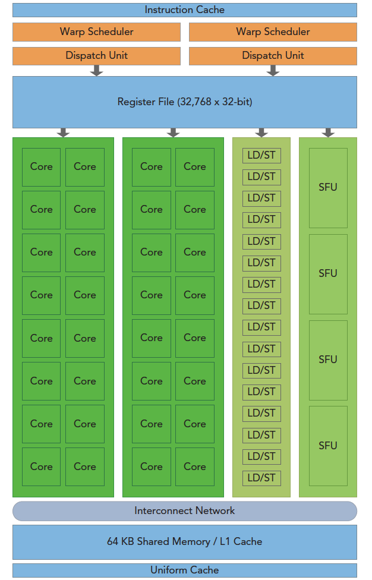

# CUDA执行模型概述

:::tip

执行模型会提供一个操作视图，这个视图可以帮助我们理解CUDA程序的执行过程。CUDA 执行模型揭示了GPU并行架构的视图，根据这个视图我们可以分析线程的并发。

学习CUDA执行模型有助于我们沿着硬件设计的思路来编写CUDA程序，这样我们编写的CUDA程序才能够充分利用GPU的并行计算能力。

:::

## GPU 架构概述

:::tip

GPU架构是围绕一个流式多处理器（SM）的可扩展阵列搭建的。可以通过复制这种架构的构建块来实现GPU的硬件并行。

:::

下图说明了 `Fermi SM` 的关键组建：

  

上图中有如下的关键组件：

- CUDA核心 （对应图中的Core）
- 共享内存/一级缓存 （对应图中的Shared Memory/L1 Cache）
- 寄存器文件 （对应图中的Register File）
- 加载/存储单元 （对应图中的Load/Store Unit）
- 特殊功能单元 （对应图中的 SFU Special Function Unit）
- 线程束调度器 （对应图中的 Warp Scheduler）

:::tip

什么是Fermi SM ?

Fermi SM 是 NVIDIA 推出的第一个支持双精度浮点数的SM，它是由32个CUDA核心组成的，这些CUDA核心可以执行单精度浮点数和双精度浮点数的操作。Fermi SM 也是第一个支持CUDA C++的SM。除了 Fermi SM 之外，NVIDIA 还推出了 Kepler SM 和 Maxwell SM。

:::

### SM

流式多处理器（SM）是GPU的核心，每个SM都可以支持数百个线程的并发执行。可以把SM理解为GPU的一个计算单元，一个GPU中有很多个SM，所以GPU同时可以支持成百上千个线程的并发执行。

前面的文章中，我们学习了如何在GPU上执行一个向量加法程序，在声明核函数的时候我们需要指令每一个块中有多少个线程。多个线程块可能被分配到同一个SM中执行。

:::tip

当一个 block 被分配到一个 SM 中执行之后，他就只能在这个 SM 中执行了，不能再被分配到其他的 SM 中执行了。

:::

### 线程束

在分配给SM线程块之后，SM需要做一件事情就是把这些线程块划分到线程束里面，然后再在可用的硬件资源上进行调度执行。所谓线程束，顾名思义，就是很多线程组成的。CUDA采用单指令多线程（SIMT）架构来管理和执行线程，每32
个线程为一组，被称为线程束（warp）。线程束中的所有线程同时执行相同的指令。每个线程都有自己的指令地址计数器和寄存器状态，利用自身的数据执行当前的指令。

:::tip

一个线程束里面的线程执行的是同一条指令，但是每个线程执行的数据是不一样的。

:::

### SIMT架构与SIMD架构

SIMT 架构是指单指令多线程架构，SIMD 架构是指单指令多数据架构。SIMT 架构和 SIMD 架构的区别在于，SIMD 架构中的每个线程都是执行相同的指令，但是每个线程执行的数据是不一样的，而 SIMT 架构中的每个线程执行的是相同的指令，每个线程执行的数据也是相同的。

### 一个神奇的数字：32

前面我们说到一个线程束里面有32个线程，这个数字是怎么来的呢？这个数字是由GPU的硬件决定的，这个数字是GPU的硬件设计者根据GPU的硬件设计的时候决定的。

从概念上讲，它是SM用SIMD方式所同时处理的工作粒度。优化工作负载以适应线程束（一组有32个线程）的边界，一般这样会更有效地利用GPU计算资源。 同一个线程束可能是不饱满工作的，有的线程可以不执行指令。但是同一个线程束里面不执行指令的线程也不可以被用于执行其他指令。

