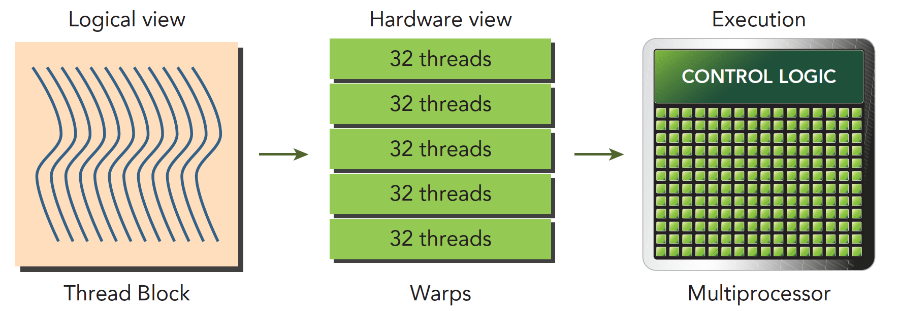

# 理解线程束执行的本质 (一)

:::tip

从硬件的角度出发，启动内核的时候并不是所有的线程都会被同时执行，而是以线程束的方式执行的。上文中我们已经了解了线程束这个概念，本文中我们将会更加深入的了解线程束的执行原理。

:::


## 线程束与线程块

我们经常会看到线程块和线程束的表述，这两者之间有什么联系和区别呢？在上文中我们已经介绍了线程束是SM的基本执行单元。逻辑上我们认为GPU有多个计算网格，一个计算网格里面所有的线程就叫做一个线程块。在内核启动之后，线程块里的线程会被分配到某个SM上，然后在被分为多个线程束。下图可以很好的说明这个问题。

  

线程块是逻辑产物，也就是说在硬件里面这个概念的不存在的。内存是一维线性存在的。这样设计的好处是可以让我们的程序更加容易理解，比如有时候我们需要对一个图形进行操作，那么三维的线程块就会更加直接。

- 在每个线程块里面，每个线程都有自己的编号，这个编号是用 threadIdx.？ 来表示的。（？可以是xyz）
- 在每个线程块里面，每个线程块都有自己的编号，这个编号是用 blockIdx.？ 来表示的。（？可以是xyz）

前面的文章里面我们已经介绍过线性地址的转换工具，这里就不在详细介绍了。

## 线程束分化

在进行cuda编程的时候, 我们可以在核函数里面写if分支。我们知道一个线程束里面一共有32个线程，同一个线程束里面的线程都执行着相同的指令。也就是说同一时间线程束里面的线程要么执行if分支要么执行else分支。

不同的线程执行的数据是不一样的，同一时间线程束里面的线程执行的指令又要完全一样。这就导致在部分线程满足if分支的条件并执行if分支的时候，其他的线程就会被阻塞，这样就导致了线程束分化的问题。

线程束分化会导致GPU的利用率降低，所以我们在编写CUDA程序的时候要尽量避免线程束分化的问题。

下面是一个代码例子，我们可以通过这个例子来更好的理解线程束分化的问题。

```cpp
#include <stdio.h>
#include <cuda_runtime.h>

__global__ void mathKernel1(float *c)
{
	int tid = blockIdx.x* blockDim.x + threadIdx.x;

	float a = 0.0;
	float b = 0.0;
	if (tid % 2 == 0)
	{
		a = 100.0f;
	}
	else
	{
		b = 200.0f;
	}
	c[tid] = a + b;
}
```

这种情况下我们假设只配置一个x=64的一维线程块，那么只有两个个线程束，线程束内奇数线程（threadIdx.x为奇数）会执行else，偶数线程执行if，分化很严重。

但是如果我们换一种方法，得到相同但是错乱的结果C，这个顺序其实是无所谓的，因为我们可以后期调整。那么下面代码就会很高效

```cpp
__global__ void mathKernel2(float *c)
{
	int tid = blockIdx.x* blockDim.x + threadIdx.x;
	float a = 0.0;
	float b = 0.0;
	if ((tid/warpSize) % 2 == 0)
	{
		a = 100.0f;
	}
	else
	{
		b = 200.0f;
	}
	c[tid] = a + b;
}
```

第一个线程束内的线程编号tid从0到31，tid/warpSize都等于0，那么就都执行if语句。 第二个线程束内的线程编号tid从32到63，tid/warpSize都等于1，执行else分支。 这样就避免了线程束分化的问题。

:::tip

1. 当一个分化的线程采取不同的代码路径时，会产生线程束分化
2. 不同的if-then-else分支会连续执行
3. 尝试调整分支粒度以适应线程束大小的倍数，避免线程束分化
4. 不同的分化可以执行不同的代码且无须以牺牲性能为代价

:::

## 参考文章

1. [CUDA C编程权威指南](https://www.baidu.com/s?ie=utf-8&f=8&rsv_bp=1&rsv_idx=1&tn=baidu&wd=CUDA%20C%E7%BC%96%E7%A8%8B%E6%9D%83%E5%A8%81%E6%8C%87%E5%8D%97&fenlei=256&rsv_pq=0xfed4a61a000e3772&rsv_t=0d02lKS%2Blx%2BdvIVO447ej8nu1F1JZ2R2sUUEGNoSYLiNj3M8QV7s%2FscVGcDD&rqlang=en&rsv_enter=1&rsv_dl=tb&rsv_sug3=2&rsv_sug1=2&rsv_sug7=101&rsv_sug2=0&rsv_btype=i&prefixsug=%2526lt%253BUDA%2520%2526lt%253B%25E7%25BC%2596%25E7%25A8%258B%25E6%259D%2583%25E5%25A8%2581%25E6%258C%2587%25E5%258D%2597&rsp=9&inputT=4428&rsv_sug4=4428)
2. [【CUDA 基础】3.2 理解线程束执行的本质(Part I)](https://face2ai.com/CUDA-F-3-2-%E7%90%86%E8%A7%A3%E7%BA%BF%E7%A8%8B%E6%9D%9F%E6%89%A7%E8%A1%8C%E7%9A%84%E6%9C%AC%E8%B4%A8-P1/)


