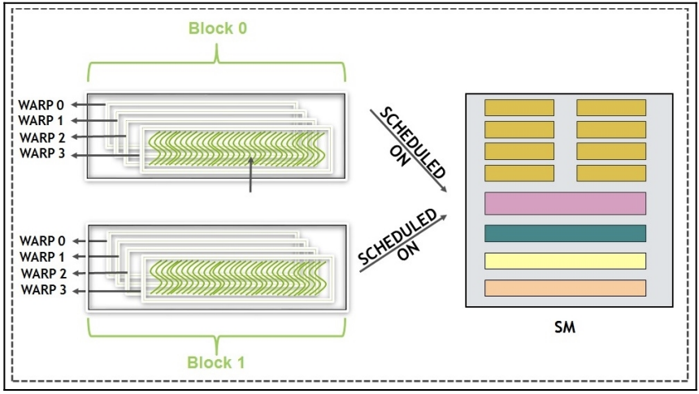
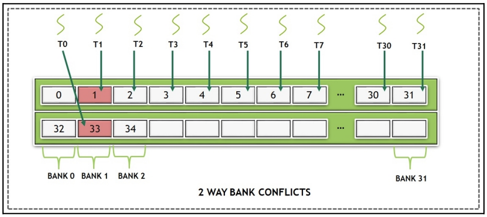

# CUDA 内存管理

:::note

CUDA 内存管理是 CUDA 编程中的一个重要部分。在本文中我们将会一起学习如何利用不同类型的GPU内存空间来提高数据访问的效率和速度，包括全局内存、共享内存、只读数据/缓存、寄存器等。如何使用锁页内存和统一内存来简化主机和设备之间的数据传输和同步，以及如何优化统一内存的性能。

:::

## 全局内存

Global memory是CUDA中的一种内存类型，可以通过静态分配（使用__device__）、动态分配（使用device malloc或new）和CUDA运行时（例如使用cudaMalloc）来分配。所有这些方法都分配物理上相同类型的内存，即从板载（但不是芯片上的）DRAM子系统中划分出的内存。

### 协同/非协同全局内存访问

CUDA编程模型中的warp是一个线程调度/执行的单元，SMs中的基本执行单元。一旦一个块被分配到一个SM，它就被划分为一个32个线程的单元，称为warp。这是CUDA编程中的基本执行单元。为了说清楚warp的概念，让我们看一个例子。如果两个块被分配到一个SM，每个块有128个线程，那么块内的warp数是128/32=4个warp，SM上的总warp数是4*2=8个warp。下面的图显示了如何将CUDA块划分并调度到GPU SM上：

  

在SM和其核上如何安排块和warp的调度更多地是与架构相关的，对于Kepler、Pascal和最新的架构Volta等不同的代数，这将是不同的。现在，我们可以忽略调度的完整性。在所有可用的warp中，具有下一条指令所需操作数的那些warp将有资格进行执行。根据运行CUDA程序的GPU的调度策略，选择warp进行执行。当被选中时，warp中的所有线程都执行相同的指令。

CUDA遵循单指令多线程（SIMT）模型，即warp中的所有线程在同一时间获取并执行相同的指令。为了最大限度地利用来自全局内存的访问，访问应该协同。协同和非协同之间的区别如下：

- 协同全局内存访问：顺序内存访问是相邻的，线程访问相邻数据，因此产生一个32位操作和1个缓存未命中。
- 非协同全局内存访问：顺序内存访问不相邻，线程的访问是随机的，并且可能导致调用32个单宽操作，因此可能有32个缓存未命中，这是最坏情况。

以下图显示了更详细的访问模式示例。图表左侧显示了协同访问，其中来自warp的线程访问相邻数据，因此产生一个32位操作和1个缓存未命中。图表右侧显示了一个场景，在该场景中，来自warp内线程的访问是随机的，并且可能导致调用32个单宽操作，因此最坏情况下可能有32个缓存未命中。

这种区分协同和非协同全局内存访问对于优化CUDA程序非常重要，因为协同访问可以减少缓存未命中，从而提高性能。


协同全局内存访问适用于线程访问连续内存位置的情况，而非协同全局内存访问适用于线程访问非连续内存位置的情况。最佳选择取决于你的应用程序的访存访问模式。

**示例1：协同全局内存访问**

```cpp
__global__ void coalescedAccess(float* input, float* output, int size) {
    int tid = blockIdx.x * blockDim.x + threadIdx.x;
    
    if (tid < size) {
        // 协同内存访问，线程访问连续内存位置
        output[tid] = input[tid] * 2.0f;
    }
}
```

在上面的示例中，每个线程都访问连续的内存位置（`input[tid]` 和 `output[tid]`），这是协同内存访问的典型示例。这种情况下，应该使用协同内存访问，因为线程对内存的访问模式是相邻的，可以充分利用内存带宽，提高性能。

**示例2：非协同全局内存访问**

__global__ void nonCoalescedAccess(float* input, float* output, int size) {
    int tid = blockIdx.x * blockDim.x + threadIdx.x;
    
    if (tid < size) {
        // 非协同内存访问，线程访问非连续内存位置
        int nonCoalescedIndex = (tid * 2) % size; // 非协同访问的示例
        output[tid] = input[nonCoalescedIndex] * 2.0f;
    }
}

在上面的示例中，每个线程都访问非连续的内存位置（`input[nonCoalescedIndex]` 和 `output[tid]`），这是非协同内存访问的典型示例。这种情况下，应该使用非协同内存访问，因为线程对内存的访问模式不是连续的，协同内存访问可能不适用，可能导致性能下降。在这种情况下，使用非协同内存访问可能是必要的，但你仍然应该尽量减少非协同内存访问的次数，以减小性能损失。


### 内存吞吐量分析

对于应用程序开发者来说，理解应用程序的内存吞吐量变得非常重要。

想要进行性能分析可以使用，性能分析工具：

- NVIDIA Nsight系列工具：NVIDIA提供了一系列用于GPU性能分析的工具，如Nsight Compute和Nsight Systems。这些工具可以提供关于内存带宽、内存利用率、内存事务等方面的详细信息。Nsight Compute特别适用于分析内核函数的性能，而Nsight Systems用于系统级别的性能分析。
- AMD ROCm Profiler：对于AMD GPU，ROCm Profiler是一个性能分析工具，可以用于分析内存性能以及其他GPU性能方面的信息。
- Visual Profiling工具：一些集成开发环境（IDE）如Visual Studio和CodeXL提供了GPU性能分析工具，用于分析内存吞吐量和其他性能指标。


如下的性能指标可以用于分析内存性能：

- 内存带宽：内存带宽是描述GPU内存性能的重要指标。它表示GPU能够每秒传输的数据量。你可以使用性能分析工具来查看内存带宽的实际利用率。
- 内存事务：内存事务描述了GPU与全局内存之间的数据交换。你可以查看内存事务的数量和类型（例如，全局内存、共享内存、L1/L2缓存等）来评估内存访问的效率。
- 内存利用率：内存利用率表示GPU内存的使用情况。低内存利用率可能意味着存在内存浪费或未优化的内存访问模式。

## 共享内存

共享内存在CUDA内存层次结构中扮演着关键的角色，被称为用户管理缓存。它提供了一种机制，使用户能够以协同的方式从全局内存中读取/写入数据，并将其存储在一个**类似于缓存但可由用户控制的内存中**。在这一节中，我们将不仅介绍如何充分利用共享内存的步骤，还将讨论如何高效地从共享内存中加载/存储数据以及它在内部是如何组织的。

共享内存仅对同一块中的线程可见，同一块中的所有线程看到的是相同版本的共享变量。

**共享内存与CPU缓存类似，但与CPU缓存不同的是，共享内存可以显式地管理。它具有比全局内存低一个数量级的延迟，以及比全局内存高一个数量级的带宽**。然而，共享内存的主要用途在于**块内的线程可以共享内存访问**。CUDA程序员可以使用共享变量来存储在内核执行期间多次重复使用的数据。此外，由于同一块内的线程可以共享结果，这有助于避免冗余计算。

在CUDA Toolkit的版本9.0之前，它并未提供可靠的线程之间通信的机制。我们将在后续章节中更详细地介绍CUDA 9.0中的通信机制。目前，我们可以假设在CUDA中，线程之间的通信只能通过利用共享内存来实现。

:::note

CUDA Toolkit 9.0之后引入了一种新的通信机制，称为"NVIDIA Cooperative Groups"，它提供了更灵活和可靠的线程之间通信方式。这个机制允许不同块中的线程进行协同操作，而不仅仅局限于同一块内的线程。

:::

### 共享内存上的矩阵转置

在本节中，我们将学习如何使用共享内存来实现矩阵转置。矩阵转置是一个常见的操作，它在很多应用中都有用到，例如矩阵乘法、图像处理等。在本节中，我们将学习如何使用共享内存来实现矩阵转置，以及如何利用共享内存来提高性能。

下面是用全局内存实现矩阵转置的代码：

```cpp
__global__ void matrix_transpose_naive(int *input, int *output) {
 int indexX = threadIdx.x + blockIdx.x * blockDim.x;
 int indexY = threadIdx.y + blockIdx.y * blockDim.y;
 int index = indexY * N + indexX;
 int transposedIndex = indexX * N + indexY;
 output[index] = input[transposedIndex];
}
```

这个代码片段中，我们使用了一个简单的内核函数来实现矩阵转置。这个内核函数的输入是一个二维矩阵，输出是转置后的矩阵。这个内核函数的实现非常简单，但是它的性能并不高。这是因为它的内存访问模式是非协同的，因此它的性能受到了内存带宽的限制。

我们可以使用nvprof来分析这个内核函数的性能。下面是nvprof的输出：

  


解决这个问题的一种方法是利用高带宽和低延迟的内存，比如共享内存。关键在于以协同的方式从全局内存中读取和写入数据。在这里，对共享内存的读取或写入可以是非协同的模式。使用共享内存可以提供更好的性能，将时间缩短到21微秒，速度提高了3倍。

```cpp
__global__ void matrix_transpose_shared(int *input, int *output) {
  __shared__ int sharedMemory[BLOCK_SIZE][BLOCK_SIZE];
  //global index
  int indexX = threadIdx.x + blockIdx.x * blockDim.x;
  int indexY = threadIdx.y + blockIdx.y * blockDim.y;
  //transposed global memory index
  int tindexX = threadIdx.x + blockIdx.y * blockDim.x;
  int tindexY = threadIdx.y + blockIdx.x * blockDim.y;
  //local index
  int localIndexX = threadIdx.x;
  int localIndexY = threadIdx.y;
  int index = indexY * N + indexX;
  int transposedIndex = tindexY * N + tindexX;
  //transposed the matrix in shared memory.
  // Global memory is read in coalesced fashion
  sharedMemory[localIndexX][localIndexY] = input[index];
  __syncthreads();
  //output written in global memory in coalesed fashion.
  output[transposedIndex] = sharedMemory[localIndexY][localIndexX];
}
```

这段代码实现了一个CUDA核函数（`__global__`修饰的函数），用于将输入矩阵转置并将结果存储到输出矩阵中。以下是代码的解释：

1. `__shared__ int sharedMemory[BLOCK_SIZE][BLOCK_SIZE];`
   - 这行声明了一个共享内存数组`sharedMemory`，它是一个二维数组，用于在共享内存中存储矩阵数据。`BLOCK_SIZE`是一个常量，表示每个线程块（block）中的线程数。
2. 接下来的几行代码计算了当前线程的全局索引、转置后的全局索引和局部索引。这些索引将用于确定每个线程在输入矩阵和共享内存中的读取位置和在输出矩阵中的写入位置。
3. `int index = indexY * N + indexX;` 和 `int transposedIndex = tindexY * N + tindexX;`
   - 这两行计算了当前线程在输入矩阵和输出矩阵中的线性索引，以便读取和写入数据。
4. `sharedMemory[localIndexX][localIndexY] = input[index];`
   - 这行代码从全局内存中读取数据，并将其存储到共享内存中。读取操作是以协同的方式进行的，因为多个线程会同时读取相邻的数据。
5. `__syncthreads();`
   - 这是一个同步点，确保所有线程在继续执行之前都已经完成了共享内存的数据读取操作。这是必要的，因为后续的写入操作需要共享内存中的数据是完整的。
6. `output[transposedIndex] = sharedMemory[localIndexY][localIndexX];`
   - 这行代码从共享内存中读取数据，然后将其写入到全局内存中的输出矩阵中。写入操作也是以协同的方式进行的，因为多个线程会同时写入相邻的数据。

通过这个核函数，输入矩阵中的数据被有效地转置到输出矩阵中，而且由于共享内存的使用，读取和写入操作以协同的方式进行，从而提高了性能。这个核函数通常在GPU上并行处理大型矩阵时非常有用。

:::tip

在CUDA中，__shared__修饰符用于声明共享内存，这些共享内存是每个线程块（block）共享的，而不是每个线程独立拥有的。因此，在核函数内部声明的sharedMemory只会在每个线程块中创建一次，而不会在每个线程中重复创建。

:::

### 共享内存中的访存冲突

在上一节中，我们学习了如何使用共享内存来实现矩阵转置。在这一节中，我们将学习如何避免共享内存中的访存冲突，以提高性能。

访存冲突是指同一个warp中的线程访问共享内存时，如果有多个线程访问同一个bank，就会导致访问冲突和延迟。bank是共享内存的最小单元，每个bank可以同时为一个线程提供数据。如果多个线程同时访问同一个bank，那么它们的访问就会被串行化，从而降低性能。为了避免或减少访存冲突，可以使用一些技巧，如改变数据布局、使用padding、使用shuffle指令等。

下图就展示了一个访存冲突的例子。

  

上面我们写的用共享内存实现矩阵转置的代码，会产生访存冲突。我们可以使用padding来避免访存冲突。padding是指在共享内存中的每个bank之间插入一些空间，从而使每个线程访问的bank不同。这样就可以避免访存冲突，提高性能。

只需要修改一句话，就可以避免访存冲突：

```cpp
__shared__ int sharedMemory[BLOCK_SIZE][BLOCK_SIZE + 1];
```

这里我们在共享内存的第二维度上增加了一个维度，从而使每个线程访问的bank不同，从而避免了访存冲突。在上述代码片段中，我们使用了matrix_transpose_shared核函数，展示了填充（padding）的概念，它消除了内存块冲突（bank conflicts），从而更好地利用了共享内存带宽。像往常一样，运行代码并使用Visual Profiler验证这种行为。经过这些改进，能看到核函数的执行时间缩短到13微秒，进一步提高了60%的速度。

在本节中，我们学习了如何最优地利用共享内存，它既提供读取又提供写入的功能，类似于一个临时存储区。但有时，数据是只读输入，不需要写入访问。在这种情况下，GPU提供了一种称为纹理内存（texture memory）的优化内存。我们将在后续文章中详细介绍它，以及它为开发人员提供的其他优势。在接下来的部分，我们将介绍只读数据的处理方法。


