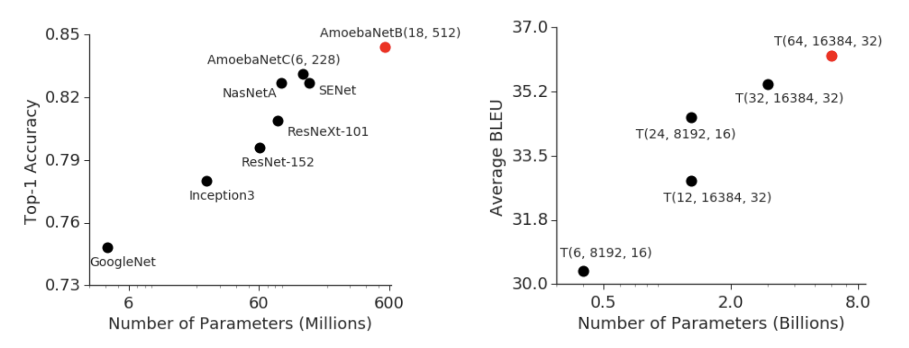

# Gpipe 论文阅读

## 1. 介绍

随着深度学习的发展，我们可以发现更大的模型具有更好的性能。

  

但是，随着模型的增大，一些问题也随之而来，比如 GPU 内存不够，通信开销大等。这些问题会导致训练速度变慢，甚至无法训练。在这个背景下人们就开始研究如何提高多卡训练的效率。

在 Gpipe 提出之前，一般的并行方法就是数据并行和模型并行。这俩种并行方法在之前的文章[^1]中都有介绍，简单来说，数据并行是将数据分成多份，每个 GPU 计算一部分数据，然后将结果合并；模型并行是将模型分成多份，每个 GPU 计算一部分模型，然后将结果合并。

数据并行可以将训练的效率提高到线性，但是对于一张卡内存不够的情况，数据并行就无法使用了。而模型并行可以解决一张卡内存不够的问题，但是模型并行的效率并不高，因为模型并行会导致通信开销变大。

  

## 2. Gpipe

### 2.1 Gpipe 的核心思想

Gpipe 是一种新的并行方法，它可以同时解决数据并行和模型并行的问题。Gpipe 的核心思想是将模型分成多个子模型，每个子模型在不同的 GPU 上计算，然后将结果合并。这样就可以同时解决一张卡内存不够和通信开销大的问题。

我们可以看一下上图里面的例子，假设我们有 4 个 GPU，我们将模型分成 4 个子模型，每个子模型在不同的 GPU 上计算。对于普通的模型并行，同一个时刻只有一个子模型在计算，这造成了计算资源的浪费。

Gpipe 引入了 “微批次” 的概念 （micro-batch），每个子模型在计算的时候，会将输入数据分成多个小批次，每个小批次在不同的 GPU 上计算。这样就可以充分利用计算资源，提高训练的效率。

### 2.2 进一步优化内存效率

我们知道在前向计算过程中，前向算子会计算出大量的中间结果，由于这些中间结果是训练数据和算子计算得到的，所以训练数据的 batch size 越大，中间结果占用的内存也就越大[^2]。 Gpipe 引入了 “重计算” 的技术（re-compute），可以减少中间梯度的内存占用。

重计算的核心思想是前向计算时，除了小部分必须存储在内存中的张量外，其他中间结果都将被删除；在反向计算中，首先重新计算一遍前向算子，以获得中间结果，再运行反向算子[^2]。

## 3. 总结

Gpipe 是一种新的并行方法，可以同时解决数据并行和模型并行的问题。Gpipe 的核心思想是将模型分成多个子模型，每个子模型在不同的 GPU 上计算，然后将结果合并。Gpipe 引入了 “微批次” 的概念，可以充分利用计算资源，提高训练的效率。同时，Gpipe 还引入了 “重计算” 的技术，可以减少中间梯度的内存占用。

后续的很多工作都是基于 Gpipe 的思想进行的，比如经典的 1F1B[^1] 流水线并行等。

[^1]: https://space.keter.top/docs/high_performance/%E5%88%86%E5%B8%83%E5%BC%8F/Paddle%E5%B9%B6%E8%A1%8C%E7%BC%96%E6%8E%92%E4%B8%8E%E6%89%A7%E8%A1%8C

[^2]: https://www.paddlepaddle.org.cn/documentation/docs/zh/guides/06_distributed_training/data_parallel/recompute_cn.html#qianxiangzhongjisuan
