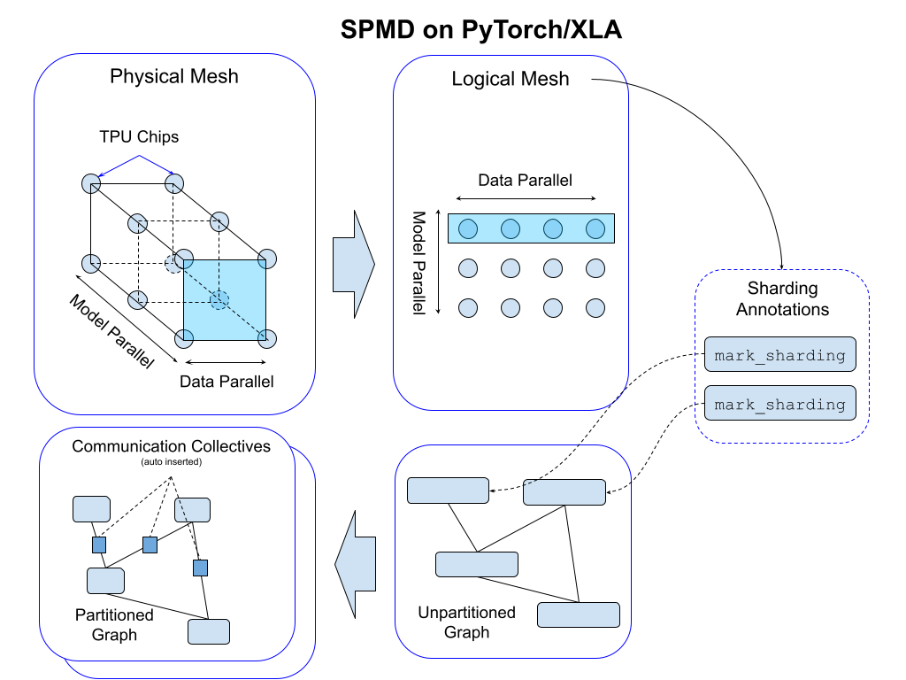

# PyTorch/XLA SPMD

:::note

PyTorch/XLA SPMD：通过自动并行化提升模型训练与服务性能[^1]

:::


PyTorch/XLA SPMD，这是将 GSPMD 集成到 PyTorch 中的易用 API。借助这一创新，PyTorch 开发者可以在谷歌云 TPU 等 AI 加速器上训练和服务最大规模的神经网络，同时最大化资源利用率。

## 1. GSPMD 简介

GSPMD 是一种自动并行化系统，它能将单设备程序自动转变为多个设备的并行程序。通过用户提供的分片（sharding）提示，XLA 编译器能将程序分成多个部分并在不同设备之间进行通信。这意味着开发者可以像写单机代码一样编写 PyTorch 多机程序，而无需自己处理 sharding 计算和通信操作。

## 2. PyTorch/XLA SPMD

在了解 SPMD 之前我们需要先了解一些基本概念。

### 2.1 Mesh（网格）

对于给定的设备集群，Mesh 表示设备之间的连接拓扑。我们可以基于此拓扑创建逻辑网格，将设备分成多个子组，用于模型中不同张量的分区。

  

这张图展示了 PyTorch/XLA 中的 SPMD 如何通过 Mesh 实现模型并行和数据并行。

左上角的部分展示了物理网格（Physical Mesh），这是 TPU 芯片的实际互连拓扑。物理网格表示硬件设备之间的连接关系，图中展示了两种并行方式：模型并行（Model Parallel）和数据并行（Data Parallel）。在模型并行中，模型的不同部分被分配到不同的设备上进行计算；在数据并行中，相同的模型副本处理不同的数据批次，每个设备处理一部分数据。

接着我们看到逻辑网格（Logical Mesh），这是在物理网格基础上抽象出来的，用于表示模型并行和数据并行中的设备分组方式。图中的逻辑网格展示了设备如何被划分以实现数据并行和模型并行。通过逻辑网格，可以灵活配置数据并行和模型并行的组合，最大化硬件资源的利用率。

右侧部分展示了分片注释（Sharding Annotations），开发者可以通过 mark_sharding API 对张量进行分片注释。这些注释标记了张量在逻辑网格中的分片方式，并会被自动转换为适当的通信操作，确保在程序执行时功能正确性。

左下角的部分展示了自动插入的通信操作（Communication Collectives）。这些操作负责在不同设备之间传输数据，确保分片计算的正确性。图中展示了分区后的程序图（Partitioned Graph）如何通过通信操作连接起来，这些操作是自动插入的，开发者无需手动处理。

右下角展示了未分区的程序图（Unpartitioned Graph），这是开发者编写的原始程序图。在应用分片注释和通信操作后，原始程序图会被转换为分区后的程序图，并在多个设备上并行执行。

Mesh 可以通过 Mesh API 抽象出来，下面是一个例子：

```python
import numpy as np
import torch_xla.runtime as xr
import torch_xla.experimental.xla_sharding as xs
from torch_xla.experimental.xla_sharding import Mesh

# 启用XLA SPMD执行模式
xr.use_spmd()

# 假设运行在有8个设备的TPU主机上
num_devices = xr.global_runtime_device_count()
# 本例中网格形状为(4,2)
mesh_shape = (num_devices // 2, 2)
device_ids = np.array(range(num_devices))
# 轴名称'x'和'y'是可选的
mesh = Mesh(device_ids, mesh_shape, ('x', 'y'))

mesh.get_logical_mesh()
# 输出: array([[0, 1],
#              [2, 3],
#              [4, 5],
#              [6, 7]])
mesh.shape()
# 输出: OrderedDict([('x', 4), ('y', 2)])
```

### 2.2 Partition Spec（分区规格）

partition_spec 的维度与输入张量相同。每个维度描述对应的输入张量维度如何跨设备网格（由 mesh_shape 定义）进行分片。Partition Spec 是一个元组（tuple），其中的每个元素描述了输入张量的一个维度如何在设备网格上进行分片。元素可以是以下几种类型：

1.	整数（int）：表示输入张量的这个维度如何映射到设备网格的某个维度。例如，0 表示映射到设备网格的第一个维度
2.	None：表示这个维度在所有设备上复制，而不是分片
3.	字符串（str）：如果设备网格的维度被命名，可以用字符串表示。例如，如果设备网格的第一个维度被命名为'x'，可以用'x'来表示

假设我们有一个设备网格，它有 8 个设备，形状为(4, 2)，并且命名为(‘data’, ‘model’)。我们可以定义不同的分区规格来描述张量如何在这个网格上分片。

```python
# 启用XLA SPMD执行模式
xr.use_spmd()

# 设备网格
num_devices = xr.global_runtime_device_count()
mesh_shape = (4, 2)
device_ids = np.array(range(num_devices))
mesh = Mesh(device_ids, mesh_shape, ('data', 'model'))

# 定义一个张量
t = torch.randn(8, 4).to(xm.xla_device())
```

**数据并行**

假设我们希望在第一个维度上实现数据并行，即每个设备处理不同的数据批次，而模型在每个设备上都相同。我们可以这样定义 Partition Spec：

```python
partition_spec = ('data', None)
xs.mark_sharding(t, mesh, partition_spec)
```

在这个例子中，第一个维度'data'表示数据将被划分到 4 个设备上，第二个维度 None 表示模型在每个设备上都完全复制。

**模型并行**

如果我们希望在第二个维度上实现模型并行，即每个设备处理模型的不同部分，我们可以这样定义 Partition Spec：

```python
partition_spec = (None, 'model')
xs.mark_sharding(t, mesh, partition_spec)
```

在这个例子中，第一个维度 None 表示数据在每个设备上都完全复制，第二个维度`model`表示模型的不同部分被划分到 2 个设备上。

**组合分片策略**

我们还可以组合不同的分片策略。例如，我们可以在第一个维度上实现数据并行，在第二个维度上实现部分模型并行：

```python
partition_spec = ('data', 'model')
xs.mark_sharding(t, mesh, partition_spec)
```

我们也可以实现部分复制。例如，在某些情况下，我们希望数据在某个维度上部分复制，而在另一个维度上完全分片：

```python
mesh = Mesh(device_ids, (2, 2, 2), ('x', 'y', 'z'))
partition_spec = ('x', None, 'z')  # 在x和z轴上分片，在y轴上复制
xs.mark_sharding(t, mesh, partition_spec)
```

在这个例子中，第一个维度 `x` 表示数据在 2 个设备上分片，第三个维度 `z` 表示数据在 2 个设备上分片，而第二个维度 None 表示数据在所有设备上复制。

### 2.3 使用例子

用户可以使用 mark_sharding API 对本地 PyTorch 张量进行注释。该 API 接收 torch.Tensor 作为输入并返回 XLAShardedTensor 作为输出。

```python
import numpy as np
import torch
import torch_xla.core.xla_model as xm
import torch_xla.runtime as xr
import torch_xla.experimental.xla_sharding as xs
from torch_xla.experimental.xla_sharded_tensor import XLAShardedTensor
from torch_xla.experimental.xla_sharding import Mesh

# 启用XLA SPMD执行模式
xr.use_spmd()

# 设备网格，这个和分区规范以及输入张量形状定义了单个分片形状。
num_devices = xr.global_runtime_device_count()
mesh_shape = (2, num_devices // 2)  # 2x4 on v3-8, 2x2 on v4-8
device_ids = np.array(range(num_devices))
mesh = Mesh(device_ids, mesh_shape, ('x', 'y'))

t = torch.randn(8, 4).to(xm.xla_device())

# 网格分区，每个设备持有输入的1/8
partition_spec = (0, 1)
m1_sharded = xs.mark_sharding(t, mesh, partition_spec)
assert isinstance(m1_sharded, XLAShardedTensor) == True
# 注意，分片注释也会原地更新到t
```

可以在 PyTorch 程序中对不同的张量进行注释以启用不同的并行技术：

```python
# 对线性层权重进行分片注释。SimpleLinear()是一个nn.Module。
model = SimpleLinear().to(xm.xla_device())
xs.mark_sharding(model.fc1.weight, mesh, partition_spec)

# 训练循环
model.train()
for step, (data, target) in enumerate(loader):
  # 假设`loader`返回的数据和目标在XLA设备上
  optimizer.zero_grad()
  # 对输入数据进行分片注释，我们可以对任何输入维度进行分片。
  # 对批量维度进行分片启用数据并行，对特征维度进行分片启用空间分区。
  xs.mark_sharding(data, mesh, partition_spec)
  output = model(data)
  loss = loss_fn(output, target)
  optimizer.step()
  xm.mark_step()
```

## 3. 总结

PyTorch/XLA SPMD 是一个强大的工具，开发者可以轻松地将单设备程序转变为多设备的并行程序，而无需自己处理 sharding 计算和通信操作。这一创新将大大提升模型训练与服务性能，最大化资源利用率。


[^1]: https://pytorch.org/blog/pytorch-xla-spmd/
[^2]: https://arxiv.org/abs/2105.04663