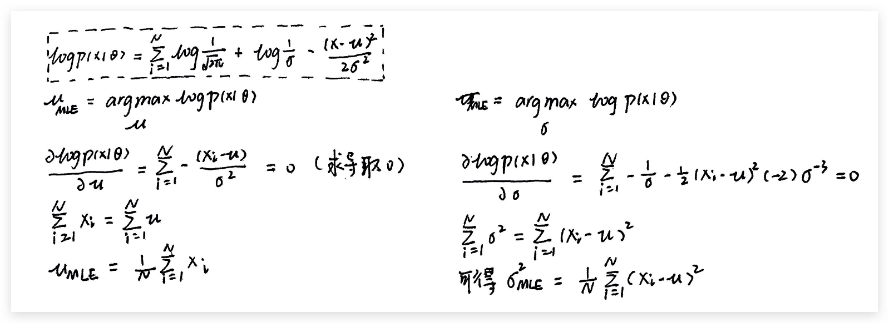

# 高斯分布

:::tip

白板推导之高斯分布：https://www.bilibili.com/video/BV1aE411o7qd?p=3&vd_source=e523696dd8dcdba1c8d4080576525c51

参考资料：https://github.com/2019ChenGong/Machine-Learning-Notes

:::

## 极大似然估计

本小节的主要目的是从频率派的角度使用极大似然估计, 通过观察到数据, 是观察到的数据出现的 概率最大化, 来对高斯分布的参数进行估计。并且分析了高斯分布的参数, $\mu, \sigma^{2}$ 的无偏性和有偏性。 其中, $\mu$ 是关于参数的无偏估计, 而 $\sigma$ 是有偏估计。

数据矩阵为：(这样可以保证每一行为一个数据点)

$$
X=\left(x_{1}, x_{2}, \cdots, x_{N}\right)^{T}=\left(\begin{array}{c}
x_{1}^{T} \\
x_{2}^{T} \\
\vdots \\
x_{N}^{T}
\end{array}\right)=\left(\begin{array}{cccc}
x_{11} & x_{12} & \ldots & x_{1 p} \\
x_{21} & x_{32} & \ldots & x_{2 p} \\
\vdots & \vdots & \ddots & \vdots \\
x_{N 1} & x_{N 2} & \ldots & x_{N p}
\end{array}\right)_{N \times P}
$$

在数据矩阵的基础上, 有 $x_{i} \in \mathbb{R}, x_{i} \sim \mathcal{N}(\mu, \Sigma)$, 那么参数为 $\theta=\mathcal{N}(\mu, \Sigma)$ 。

### 求解目的

首先对于单变量的高斯分布 $\mathcal{N}\left(\mu, \sigma^{2}\right)$, 概率密度函数为:

$$
p(x)=\frac{1}{\sqrt{2 \pi} \sigma} \exp \left\{-\frac{(x-\mu)^{2}}{2 \sigma^{2}}\right\}
$$

然而对于多变量的高斯分布 $\mathcal{N}(\mu, \Sigma)$, 概率密度函数为:

$$
p(X)=\frac{1}{{\sqrt{2 \pi^{\frac{d}{2}}}}^{\frac{d}{2}}||^{\frac{1}{2}}} \exp \left\{-\frac{1}{2}(X-\mu)^{T} \Sigma^{-1}(X-\mu)\right\}
$$

我们希望通过观察到的数据来计算参数 $\theta$ 的值, 那么我们使用极大似然估计的优化目标为 $\theta_{M L E}=$ $\operatorname{argmax}_{\theta} p(x \mid \theta)$ 。于是我们可以转化为 $\theta_{M L E}=\operatorname{argmax}_{\theta} \log p(x \mid \theta)$ 。那么, 计算公式可以化简为：

$$
\begin{aligned}
\log p(x \mid \theta) &=\log \prod_{i=1}^{N} p\left(x_{i} \mid \theta\right)=\sum_{i=1}^{N} \log p\left(x_{i} \mid \theta\right) \\
&=\sum_{i=1}^{N} \log \frac{1}{\sqrt{2 \pi}}+\log \frac{1}{\sigma}-\frac{(x-\mu)^{2}}{2 \sigma^{2}}
\end{aligned}
$$

### 极大似然求解 $\mu$ 和 $\sigma^{2}$

   

### 验证 参数无偏性

首先需要明确什么是无偏估计, 所谓无偏估计也就是, $\mathbb{E}(\hat{x})=x$ 。那么利用这个性质我们就可以 很方便的判断一个估计是否为无偏估计。

#### 验证 $\mu_{M L E}$ 的无偏性

$$
\begin{aligned}
\mathbb{E}\left[\mu_{M L E}\right] &=\mathbb{E}\left[\frac{1}{N} \sum_{i=1}^{N} x_{i}\right] \\
&=\frac{1}{N} \sum_{i=1}^{N} \mathbb{E}\left[x_{i}\right] \\
&=\frac{1}{N} N \mu=\mu
\end{aligned}
$$

根据上述的推导, 我们可以得出 $\mu_{M L E}$ 是无偏估计。

#### 验证 $ \sigma_{M L E}^{2} $ 的无偏性

$$
\begin{aligned}
&\mathbb{E}\left[\sigma_{M L E}^{2}\right]=\mathbb{E}\left[\frac{1}{N} \sum_{i=1}^{N}\left(x_{i}-\mu_{M L E}\right)^{2}\right]\\
&=\mathbb{E}\left[\frac{1}{N} \sum_{i=1}^{N}\left(x_{i}^{2}-2 \mu_{M L E} x_{i}+\mu_{M L E}^{2}\right)\right]\\
&=\mathbb{E}\left[\frac{1}{N} \sum_{i=1}^{N}\left(x_{i}^{2}-\mu_{M L E}^{2}\right)\right]\\
&=\mathbb{E}\left[\frac{1}{N} \sum_{i=1}^{N}\left(x_{i}^{2}-\mu^{2}\right)-\left(\mu_{M L E}^{2}-\mu^{2}\right)\right]\\
&=\mathbb{E}\left[\frac{1}{N} \sum_{i=1}^{N}\left(x_{i}^{2}-\mu^{2}\right)\right]-\mathbb{E}\left[\left(\mu_{M L E}^{2}-\mu^{2}\right)\right]\\
&=\mathbb{E}\left[\frac{1}{N} \sum_{i=1}^{N}\left(x_{i}^{2}-\left(\frac{1}{N} \sum_{i=1}^{N} x_{i}\right)^{2}\right)\right]-\mathbb{E}\left[\left(\mu_{M L E}^{2}-\mu^{2}\right)\right]\\
&=\frac{1}{N} \sum_{i=1}^{N}\left(\mathbb{E}\left[x_{i}^{2}\right]-\mathbb{E}[x]^{2}\right)-\mathbb{E}\left[\left(\mu_{M L E}^{2}-\mu^{2}\right)\right]\\
&=\sigma^{2}-\left(\mathbb{E}\left[\mu_{M L E}^{2}\right]-\mathbb{E}\left[\mu^{2}\right]\right)\\
&=\sigma^{2}-\left(\mathbb{E}\left[\mu_{M L E}^{2}\right]-\mathbb{E}\left[\mathbb{E}\left[\mu_{M L E}\right]^{2}\right]\right)\\
&=\sigma^{2}-\left(\mathbb{E}\left[\mu_{M L E}^{2}\right]-\mathbb{E}\left[\mu_{M L E}\right]^{2}\right]\\
&=\sigma^{2}-\operatorname{Var}\left[\mu_{M L E}\right]\\
&=\sigma^{2}-\operatorname{Var}\left[\frac{1}{N} \sum_{i=1}^{N} x_{i}\right]\\
&=\sigma^{2}-\frac{1}{N^{2}} \operatorname{Var}\left[\sum_{i=1}^{N} x_{i}\right]\\
&=\sigma^{2}-\frac{1}{N^{2}} \sum_{i=1}^{N} \operatorname{Var}\left[x_{i}\right]\\
&=\sigma^{2}-\frac{1}{N^{2}} N \sigma^{2}\\
&=\frac{N-1}{N} \sigma^{2}
\end{aligned}
$$

有上述推导我们可以得出, $\sigma_{M L E}^{2}$ 为有偏估计量, 而且和真实值比较偏小。为什么会造成这个结果呢? 主要原因是出在 $\mu_{M L E}$ 上, 因为我们在求 $\sigma_{M L E}^{2}$ 时使用的是 $\mu_{M L E}$ 而不是 $\mu_{\circ}$ 而 $\mu_{M L E}$ 是拟合 数据得到的, 所以波动的角度讲, 肯定会比使用真实的 $\mu$ 算出来要小。所以在高斯分布中, 利用极大 似然估计得到的 $\sigma_{M L E}^{2}$ 的值, 是比真实值偏小的有偏估计。

